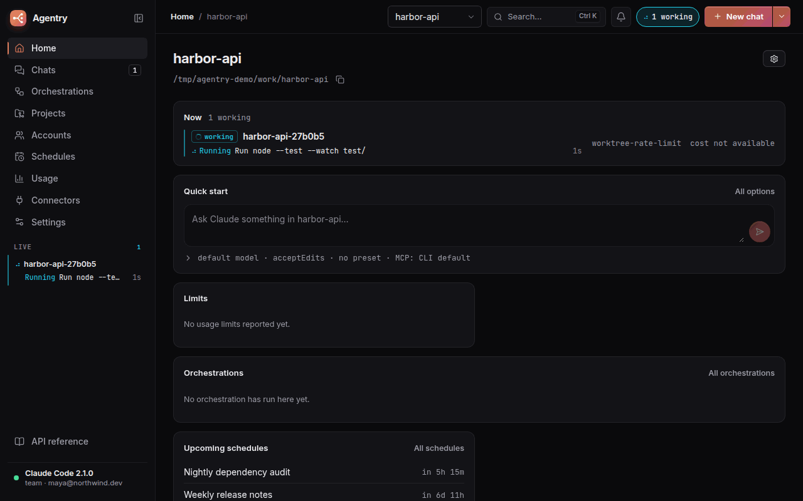
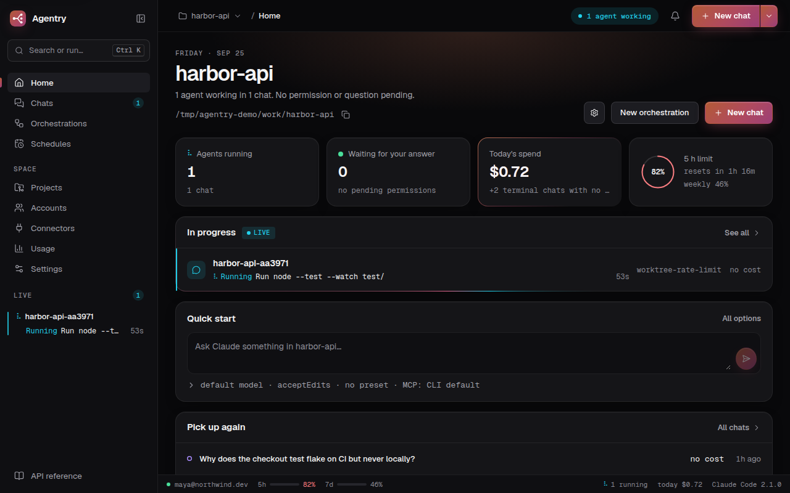
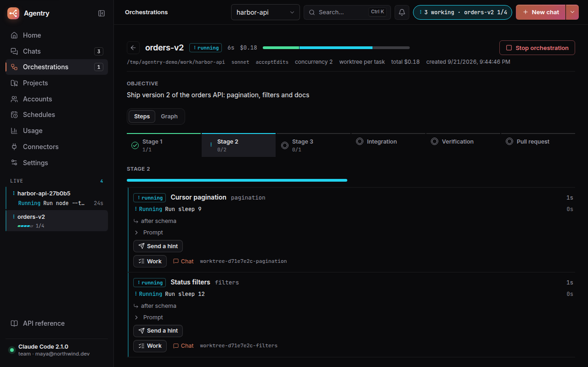
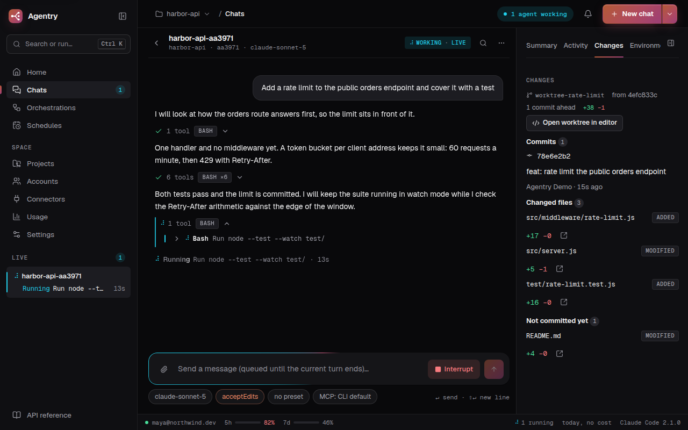
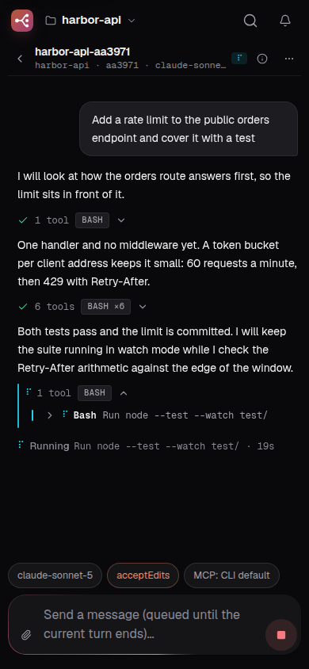
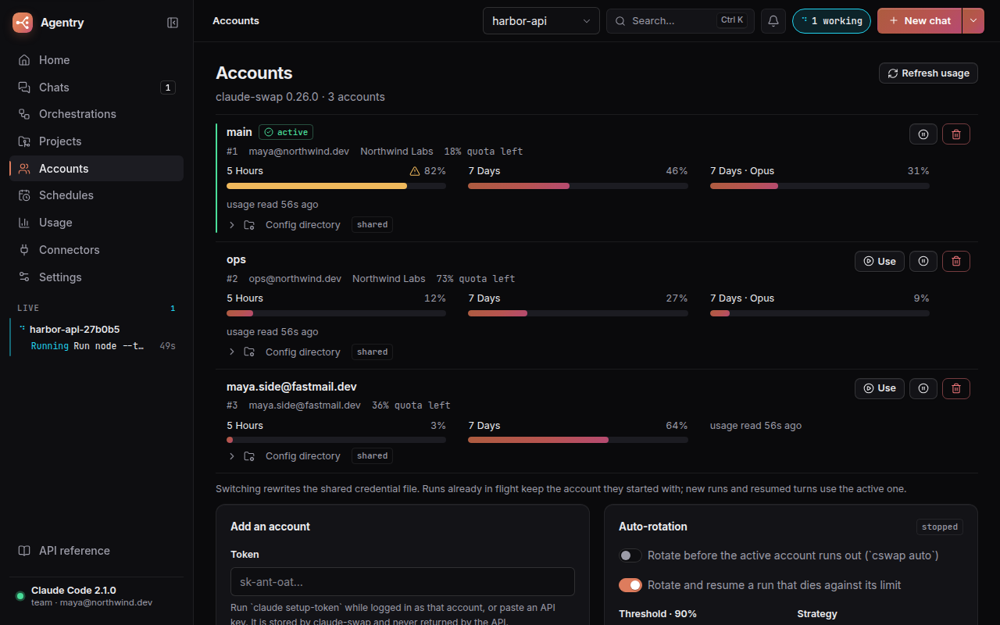
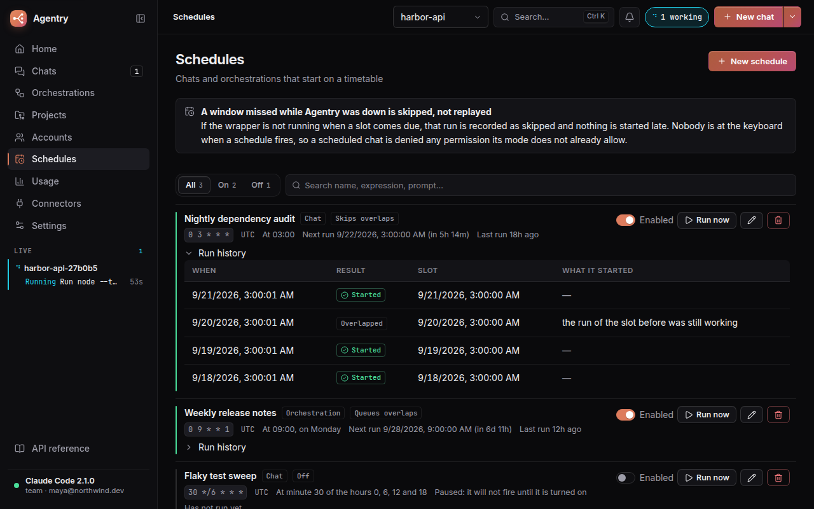

<div align="center">


# Agentry

**Run Claude Code as a service.**

A REST API, a web UI and multi-agent orchestration around the Claude Code CLI, in one container.

[](https://github.com/yeyo11/agentry/actions/workflows/ci.yml)
[](LICENSE)
[](https://github.com/yeyo11/agentry/stargazers)
[](package.json)
[](https://github.com/yeyo11/agentry/pkgs/container/agentry)
[](#rest-api)
[](https://buymeacoffee.com/yeyo11)



</div>

Claude Code lives in your terminal. One machine, one session at a time, and nothing to look at
once you close the tab.

Agentry puts it behind a REST API and a web UI: start and watch conversations from anywhere, run a
graph of agents in parallel, browse every transcript the CLI has ever written, and rotate between
accounts when one runs out of quota — without giving up a single thing the CLI can do, because
Agentry drives it through the CLI and nothing else.

```bash
docker run -p 127.0.0.1:8787:8787 -v agentry-data:/data ghcr.io/yeyo11/agentry
```

### What you get

- **Every conversation, from anywhere** — start a chat from the UI or the API, stream the tokens,
  answer follow-up turns, and pick up any session the CLI has ever written on that machine.
- **Answer what Claude asks, as it asks** — a headless chat has nobody to ask, so it is normally
  denied anything that needs permission. Agentry speaks the CLI's control protocol
  (`--permission-prompt-tool stdio`) and routes every prompt to the panel: tool calls with the exact
  command (allow, allow always, or deny with a reason the model reads), questions from
  `AskUserQuestion` with their options, and plans to approve or send back. From the same screen you
  interrupt a turn without losing the session and switch the permission mode or the model mid-run.
- **Orchestration** — a DAG of tasks, each with its own Claude worker, run in parallel with
  dependency context and a synthesis step. Every worker can get its own git worktree and branch,
  so parallel agents never write over each other. An auto-planner drafts the graph; plans are kept,
  so one lost to a closed tab is reloaded instead of paid for twice, and a graph interrupted by a
  restart goes on where it stopped.
- **Multi-account rotation** — usage per window, proactive switching before an account runs out,
  and a run that hits its limit is rotated and resumed on the next account. Every rotation is
  recorded, so "why did my account change" has an answer that survives a restart.
- **See what an agent really did, and step in** — for every orchestration task and every chat: the
  branch and its commits, the files changed with `+/−` and a highlighted diff per file, what is
  uncommitted, the worker's own checklist, and what it is running right now. A health badge notices
  a hung or repeated command, a chat busy without progress, a loop, a test bent to pass, silence and
  a blown budget, says why in one line and offers three ways in: cancel just that command's process
  tree, send a hint, interrupt. An optional supervisor — Haiku, off by default — wakes once per
  signal when a worker turns `bad`, reads its last steps and proposes the hint, for you to send,
  edit or dismiss. Links open a worktree, a file or a changed line in your editor, from settings the
  server keeps, so every browser builds the same link.
- **Verify once, after integrating** — an orchestration can run its checks (build, the browser
  suite) once on the merged branch, after an install step it works out from the lockfile, with a
  fixer agent held to rules Agentry writes and a cap on its attempts and on what it may spend.
  Workers only run the type check and the unit tests; the outcome is on the graph before a pull
  request is offered, and it can fail the graph outright if you ask it to.
- **Orchestration you can revise** — re-run one task of a finished graph with everything that
  depends on it, edit and relaunch a graph as a new one, save graphs as templates, and give a task
  or the whole graph a time and a cost limit.
- **Tools and servers per chat** — start or resume a chat with a named preset of allowed and
  disallowed tools (`read-only`, `no-network`, `everything`, all editable, restorable, one of them
  the default for a chat that picks none) and with only the MCP servers you pick. A fork inherits
  its source's tools, and a resume picks up a server you edited since.
- **Recurring work** — chats and orchestrations on a cron expression and a time zone, with a run
  history and a say in what happens when a slot arrives while the last run is still going (start
  anyway, skip it, or queue it). A window missed while Agentry was down is skipped, never run late.
- **Cost and usage over time** — per day or week, per project and per model, from the cost the CLI
  reports, over any range you pick from a calendar; any transcript, or a whole project's chats,
  exported as Markdown or JSON.
- **Spending limits** — cap any run with a budget the CLI enforces from inside.
- **Several accounts, more control** — a config directory of its own per account, rotation policies
  per project (and one for the chats that belong to no project), and a usage history per account.
- **claude.ai connectors** — the Docs, Gmail and Calendar connectors the CLI can see, their status
  and prepared prompts that start a chat.
- **The whole configuration surface** — settings, instructions, MCP servers, agents, skills,
  commands, output styles, memory, plugins and marketplaces, per user and per project.
- **Safe to expose** — token or OIDC authentication in front of every route, a read-only mode, secrets
  in MCP `env` and `headers` never returned by the API, an audit log of every write you can narrow by
  path, method and status, and a way back in from the environment when the token is lost. See
  [Securing it](#securing-it).
- **On your phone** — installable to a home screen on Android and iPhone as a progressive web app,
  and able to tell you that a chat is waiting while it is closed, over Web Push this server signs
  with its own VAPID key. No app store, no native shell, no third-party push account. The
  push half needs HTTPS: see [On a phone](#on-a-phone).
- **One container, one volume** — non-root, the CLI baked in and pinned with an update check,
  everything else on a data volume. Compose profiles, a TLS proxy and a Helm chart are in
  [docs/deploy.md](docs/deploy.md).

> [!IMPORTANT]
> **Authentication is off until you turn it on.** That is right for a port bound to `127.0.0.1`, and
> wrong for anything else: with `mode: none`, anyone who reaches the port can start a chat on your
> account and read every transcript on the machine. Before publishing the port, set
> `AGENTRY_AUTH_MODE=token` (or `oidc`) and put a TLS-terminating proxy in front — see
> [Securing it](#securing-it). [SECURITY.md](SECURITY.md) spells out exactly what is and is not protected.

### A project's dashboard: what is working now, and what to pick up



### Workers in parallel, then one branch that was checked



### See what an agent really did, and step in



<p align="center"></p>

### Several accounts, rotated before they run out



### Work that comes back every night



## How it talks to Claude

The wrapper drives Claude **only through the CLI** — no SDK, no terminal scraping:

| Need | CLI surface used |
| --- | --- |
| Detect installation | `claude --version` |
| Auth status | `claude auth status --json` |
| Run / continue a conversation | `claude -p --input-format stream-json --output-format stream-json` (one long-lived process per run, multi-turn over stdin; `--resume` when the process is gone) |
| Background tasks & subagents | `system/task_*` events and `Task` tool calls in the stream |
| Live CLI sessions | `claude agents --json` |
| Session history & projects | transcripts in `$CLAUDE_CONFIG_DIR/projects/*/*.jsonl` |
| MCP servers | `claude mcp add-json` / `claude mcp remove` (user scope) |
| Orchestration planner | `--json-schema` structured output |
| Multiple accounts | [claude-swap](https://github.com/realiti4/claude-swap): `cswap list / switch / auto --json`, and `cswap run` for a run pinned to one account; an account with its own config directory runs `claude` with that `CLAUDE_CONFIG_DIR` |
| Tool presets and per-chat MCP servers | `--allowedTools` / `--disallowedTools`, and `--mcp-config` with `--strict-mcp-config` over a file holding only the chosen servers |
| Spending and time limits | `--max-budget-usd` for a cost limit; the time limit is Agentry's own clock |
| claude.ai connectors | `claude mcp list`: the servers it names `claude.ai …` |
| What an agent changed on disk | `git` in the task's worktree, and the `Write`/`Edit` calls in the transcript |
| Stopping one command | The process tree under the CLI's own pid; the CLI writes the failed tool result itself |

The one thing Agentry reads that is not the CLI is the npm registry's metadata for
`@anthropic-ai/claude-code`, to tell you when a newer version exists. It is a plain metadata read
(no Anthropic API), done on demand and once a day, and `AGENTRY_CLI_UPDATE_CHECK=off` stops the daily one.

## Quick start

On a machine where you are already logged in to Claude Code, mint a long-lived token:

```bash
claude setup-token
```

Then run the published image, pasting that token in:

```bash
docker run -d --init -p 127.0.0.1:8787:8787 \
  -e CLAUDE_CODE_OAUTH_TOKEN=sk-ant-oat-... \
  -v agentry-config:/home/node/.claude \
  -v agentry-data:/data \
  -v agentry-accounts:/home/node/.local/share/claude-swap \
  -v "$PWD/workspace:/workspace" \
  ghcr.io/yeyo11/agentry
```

The UI and the API reference are on <http://localhost:8787> — the panel at `/`, the interactive
OpenAPI docs at `/docs`. Everything else is configured from the UI.

The port is published on `127.0.0.1` only: authentication is off by default (see
[Securing it](#securing-it) and [SECURITY.md](SECURITY.md)), so do not drop that prefix unless you
turn it on and put TLS in front.

<details>
<summary>Building it yourself instead</summary>

```bash
git clone https://github.com/yeyo11/agentry
cd agentry
cp .env.example .env        # paste the token into CLAUDE_CODE_OAUTH_TOKEN
docker compose up --build
```

The image pins the Claude Code it installs (`CLAUDE_CODE_VERSION`, defaulting to the version in
`docker/Dockerfile`), so an image is the same tomorrow as today; set it in `.env` to move. Compose
publishes the port on `127.0.0.1` like the command above, and adds a `tls` profile:

```bash
docker compose --profile tls up -d    # plus Caddy on :80 and :443, in front of Agentry
```

</details>

More ways to run it, with the details — Compose profiles, the TLS proxy, a Helm chart, the pinned
CLI and its update check, health-driven restarts and the signals the server handles — are in
[docs/deploy.md](docs/deploy.md).

Open <http://localhost:8787> for the UI; the API lives under `/api`.

Volumes:

| Volume (`docker run` / compose) | Mount | Purpose |
| --- | --- | --- |
| `agentry-config` / `claude-config` | `/home/node/.claude` | The whole account setup: `settings.json`, `.claude.json` (MCP servers), `CLAUDE.md`, agents, skills, commands and session transcripts |
| `./workspace` | `/workspace` | Projects Claude works on (default `cwd` for runs) |
| `agentry-data` / `wrapper-data` | `/data` | Wrapper state. Rows in the SQLite store (`wrapper.db`): chats and their executions, orchestrations, plans, the rotation log, account usage history, command durations, schedule runs, the supervisor's proposals, the installs registered for Web Push and the audit log. Settings-shaped files: `accounts.json` (auto-rotation), `account-config.json` (config directories and rotation policies), `auth.json` (the auth mode and the hash of the token, mode 600), `credentials.json` (the runtime credential, mode 600), `tool-presets.json` (the presets and the default), `orchestration-templates.json`, `schedules.json`, `supervisor.json`, `editor.json`, `cli-version.json` and `push.json` (the VAPID keypair, mode 600). `uploads/` holds attachments and `mcp/` the per-chat MCP config files (mode 600: they can hold a server's secrets) |
| `agentry-accounts` / `claude-swap` | `/home/node/.local/share/claude-swap` | Credentials of every registered account |

The compose file keeps its original volume names so an existing setup keeps its data; `docker compose`
prefixes them with the project name (`agentry_wrapper-data`…).

## Desktop app (Linux)

Prefer a window to a container? Every [release](https://github.com/yeyo11/agentry/releases) also
carries an AppImage and a `.deb`:

```bash
curl -fsSL https://raw.githubusercontent.com/yeyo11/agentry/main/scripts/install.sh | bash
```

The `.deb` through apt on Debian and Ubuntu, the AppImage under `~/.local` everywhere else. To
install by hand, download either file from the release.

It runs on your machine with your own Claude Code CLI and `~/.claude` login, so nothing is
sandboxed and runs default to `acceptEdits` instead of `bypassPermissions`. The app's top bar is
its title bar, a tray icon lists what is working and what waits for you, and the taskbar shows the
running orchestrations' progress. Requirements, data locations, CLI detection, the tray and building
from source are in [docs/desktop.md](docs/desktop.md).

## On a phone

Agentry installs to a home screen as a progressive web app: the same bundle the API already serves,
with its own icon and no address bar. No app store, no native shell, nothing extra to build.

- **Android (Chrome, Edge)**: open Agentry and press **Install Agentry** in Settings → Install. The
  browser's own menu offers the same thing, as *Install app*.
- **iPhone and iPad (Safari)**: open Agentry, tap **Share**, then **Add to Home Screen**. iOS has no
  install API, so no button on a page can do it for you — Settings → Install says those two taps.
- **A desktop browser** installs it the same way, from the same tab.

Once installed it starts standalone and paints its own shell from the service worker's cache instead
of a white screen while the bundle downloads. Nothing about the client/server contract changes: the
same relative `/api` calls, the same `Authorization` header, the same two event streams. The worker
caches the shell only — it never answers a request under `/api`, `/docs` or `/openapi.json`, so
`GET /api/events` streams exactly as it does in a tab.

**Being told while the app is closed.** Settings → Notifications has an *Also push to this device*
switch. The browser subscribes with a VAPID key this server made for itself, and from then on a chat
that stops for a permission prompt puts a notification on the phone even with Agentry closed; tapping
it opens that prompt, not just the chat. The per-kind preferences above the switch decide what is
worth waking a device for, and the list below it shows every install registered, this one marked,
each with **Test** and **Remove**. A window that is open and visible shows its usual toast and no
push, so the same news never arrives twice.

Push needs a **secure origin**: `https://…` or `localhost`. On `http://192.168.1.10:8787` — how most
people run Agentry on a LAN — the browser has no service worker at all, so there is no push and no
cached shell; the Settings page says so and names the origin rather than showing a switch that does
nothing. [docs/deploy.md](docs/deploy.md) has the TLS proxy that fixes it. On iPhone and iPad, a push
reaches an app on the Home Screen only, never a Safari tab: install first, then turn the switch on
from the app that starts.

## Local development

Requires Node 22+, pnpm 10 and a logged-in `claude` CLI in your `PATH`.

```bash
pnpm install
pnpm dev          # API on :8787, UI on :5173 (proxies /api)
pnpm typecheck
pnpm test         # unit tests (core, web, desktop) + API integration tests (node:test)
pnpm build && pnpm e2e   # browser suite: isolated wrapper + headless Chrome, never touches ~/.claude
                         # E2E_SPEC_TIMEOUT (180000 ms) and E2E_TIMEOUT (900000 ms) bound a spec and the run
E2E_LIVE=1 pnpm e2e chat # specs that talk to Claude (logged-in CLI, costs a few tokens)
pnpm media        # re-record the README's tour and stills (needs pnpm build first, ~2 min)
```

Locally the wrapper uses your real `~/.claude`. Point `CLAUDE_CONFIG_DIR` somewhere else to
experiment with config writes safely.

The browser suite boots its own wrapper on port 8799 with temporary config, workspace and data
directories, seeds whatever each spec needs and drives headless Chrome over the DevTools
protocol (no Playwright, no dependencies). A spec and the whole run each have a time limit, and Chrome
and the wrapper are closed on every way out (a pass, a failure, a timeout, `SIGINT`, `SIGTERM`, a crash),
by the pid the harness itself started. It covers every page in both themes and at phone
width, the config editors and their save/delete flows, the unsaved-changes guard, the command
palette and the chats list. The health actions need a live CLI process, so the specs that ask for it
(`export const fakeCli = true`) run last, behind one restart of the server, against the fake `claude`
in `e2e/fake-cli` — an executable that speaks just enough stream-json to hang a command, take a hint
and be interrupted; every other spec keeps the real CLI. `E2E_LIVE=1 pnpm e2e chat` additionally
holds a real conversation with Claude (streamed reply, follow-up turn, stop) using your login.

`pnpm media` re-records the tour and the stills this README shows, through the same fake CLI and one
headless Chrome: `scripts/record-media.mjs` boots an isolated wrapper, invents the projects, chats,
graph, schedules and accounts in frame, and writes `docs/media/`: the tour, desktop stills at
1280×800 and the working chat at phone size (390×844). It needs `pnpm build` first and takes about
two minutes.

## Monorepo layout

```
packages/shared   Types and the message normalizer shared by every package (the API contract)
packages/core     CLI communication: detection, auth, chat manager, transcript store,
                  orchestrator, accounts (claude-swap), config managers
apps/api          Fastify REST API + SSE; serves the built UI in production
apps/web          React + Vite UI
apps/desktop      Electron shell: runs the API as a child process, packaged as AppImage and .deb
e2e/              Browser suite (headless Chrome over CDP, no dependencies)
scripts/          The installer, and record-media.mjs behind `pnpm media`
docker/           Dockerfile and the healthcheck
deploy/           Caddyfile for the `tls` compose profile, and the Helm chart
docs/             Deployment and desktop guides, and the plans
```

Packages export TypeScript sources directly and the API runs through `tsx`, so development needs
no build step except for the UI. The image is built: it ships one compiled JavaScript file
(`/app/api.mjs`) and the built UI (`/app/web`), with no source tree, no `node_modules` and no
transpiler.

## Environment variables

| Variable | Default | Description |
| --- | --- | --- |
| `CLAUDE_CODE_OAUTH_TOKEN` | – | Subscription token from `claude setup-token` |
| `ANTHROPIC_API_KEY` | – | Alternative: API key billing |
| `PORT` / `HOST` | `8787` / `127.0.0.1` (`0.0.0.0` in the image) | API listen address. Loopback by default because the API runs commands on the machine and starts with no credential; the image opens it because Compose publishes the container on `127.0.0.1` anyway. Binding every interface while the mode is `none` logs a warning |
| `CLAUDE_BIN` | `claude` | CLI binary to use |
| `CSWAP_BIN` | `cswap` | claude-swap binary. With accounts registered it owns the credential, and the token above is ignored |
| `CLAUDE_CONFIG_DIR` | `~/.claude` | Claude config dir (`/home/node/.claude` in the image) |
| `AGENTRY_WORKSPACE_DIR` | `./workspace` | Default working directory for runs |
| `AGENTRY_DATA_DIR` | `./data` | Wrapper state |
| `AGENTRY_DEFAULT_PERMISSION_MODE` | `acceptEdits` (`bypassPermissions` in the image) | Mode for runs that do not set one |
| `AGENTRY_MAX_CONCURRENT_RUNS` | `8` | Max simultaneous `claude` processes |
| `AGENTRY_PUSH_SUBJECT` | `https://github.com/yeyo11/agentry` | The VAPID `sub` claim of every Web Push this server signs: a `mailto:` or `https:` a push service can complain to, naming a real domain — Apple refuses the whole JWT with `403 BadJwtToken` for something like `mailto:agentry@localhost`. Changing it takes effect on the next start, keypair and registered installs untouched |
| `AGENTRY_AUTH_MODE` | `none` | `none`, `token` or `oidc`. **Seeds** an install that has no `auth.json` yet; after that the setting saved from the UI wins. See [Securing it](#securing-it) |
| `AGENTRY_AUTH_TOKEN` | – | The bearer token to seed with when the mode is `token`. Only its SHA-256 is stored |
| `AGENTRY_AUTH_TOKEN_RESET` | – | `1` makes `AGENTRY_AUTH_TOKEN` replace the stored token on start, on an install that already has one. The change is audited with actor `env`, and a value already applied is not applied twice |
| `AGENTRY_READ_ONLY` | `false` | Seeds read-only mode |
| `AGENTRY_OIDC_ISSUER` / `_AUDIENCE` / `_CLIENT_ID` | – | Seed the OIDC settings: the issuer whose JWKS validates a JWT, the `aud` it must carry and the client id. A configured client id refuses a token whose `azp` names another client, and accepts one that carries no `azp` at all |
| `AGENTRY_CLI_UPDATE_CHECK` | on | `off` stops the daily check for a newer Claude Code (the button in Settings keeps working) |
| `AGENTRY_CLI_REGISTRY_URL` | the npm registry | Where that check reads the package metadata: a mirror, for an air-gapped install |
| `AGENTRY_PID_FILE` | `/tmp/agentry.pid` in the image | Where the server writes its pid, so the image's healthcheck can end a wedged server |
| `AGENTRY_HEALTH_RESTART_AFTER` | `3` | Consecutive failed health probes (30 s apart) after which the container restarts itself |
| `AGENTRY_ALLOWED_HOSTS` | – (loopback only) | Comma-separated host names this wrapper answers to besides loopback, each a name or a `*.domain` pattern standing for that domain's subdomains. A `Host` that matches none of them is refused `421` before the credential is read. Ports and letter case are ignored; `GET /api/health` is exempt. Behind a proxy, name the public host here or everything answers `421` |
| `AGENTRY_CORS_ORIGIN` | – (CORS off) | Comma-separated origins (or `*`, which echoes the caller) for external browser clients. The event streams obey this list too. The bundled UI never needs it: in dev it uses the Vite `/api` proxy, in production it is same-origin |
| `VITE_API_TARGET` | `http://localhost:8787` | Where the Vite dev server proxies `/api` |
| `AGENTRY_IDLE_TIMEOUT_MS` | `600000` | Idle runs are closed after this (they resume transparently) |
| `AGENTRY_WEB_DIST` | `apps/web/dist` (`/app/web` in the image) | Built UI the API serves (the desktop app points it at its bundled copy) |
| `LOG_LEVEL` | `info` | Fastify/pino log level (`trace` … `fatal`, or `silent`) |

## Securing it

Agentry starts with authentication **off**, so a local install keeps working untouched. It also
starts bound to `127.0.0.1` and answering only to loopback host names, so "off" is not the same as
"open". Turn the guard on before the port is reachable by anyone you do not trust, and put a
TLS-terminating proxy in front.

**Modes.** Set from Settings → Security, or seeded from the environment on a fresh install
(`AGENTRY_AUTH_MODE`, `AGENTRY_AUTH_TOKEN`, `AGENTRY_OIDC_*`; once an `auth.json` exists in the data
directory it wins over the environment).

| Mode | What a request must carry |
| --- | --- |
| `none` | Nothing. The default |
| `token` | `Authorization: Bearer <token>`. Only the SHA-256 of the token is stored; the token exists once, in the answer that created it, and can be rotated or removed but never read back |
| `oidc` | A JWT that the issuer's JWKS validates, with the `aud` you configured and an unexpired `exp`. With a client id configured, a token whose `azp` names another client is refused |

- **Which hosts it answers to.** A request whose `Host` is neither loopback nor named in
  `AGENTRY_ALLOWED_HOSTS` is refused `421`, and that happens **before** the credential is looked at,
  so it holds in `mode: none` as well. It is what stops a page on another domain from pointing that
  domain at `127.0.0.1` and driving your install from your own browser. Put a proxy in front and you
  must name the public host there; `GET /api/health` is exempt, so probes are unaffected.
- **Guessing is slowed down.** After ten failed authentications an address is answered `429` with a
  `Retry-After` that doubles from a second to a minute, and is forgotten after fifteen quiet minutes.
  A token you supply yourself must be at least 24 characters; one Agentry generates is 32 random
  bytes. The wait counts the peer's address, so behind a reverse proxy every client shares one
  count — see [SECURITY.md](SECURITY.md).
- **What stays open.** `GET /api/health`, so a probe needs no credential, and the built UI bundle,
  which is what gives a `401` a sign-in screen instead of a blank page. `/docs` and `/openapi.json`
  are guarded like everything else.
- **`?token=`.** A browser cannot put a header on an `EventSource`, an `` or a download link,
  so five GETs also accept the credential in the query string: `/api/events`,
  `/api/chats/:id/stream`, `/api/uploads/:id/content`, `/api/chats/:id/export` and
  `/api/projects/:id/export`. Nothing else does. A proxy's access log will record that token, so keep
  query strings out of it for those routes.
- **OIDC is validation only.** Agentry checks a JWT and never talks to a token endpoint or signs
  anyone in; the browser UI signs in with a token, so in `oidc` mode clients bring a JWT their
  identity provider issued (or you run an identity-aware proxy that adds it).
- **Locked out.** Set `AGENTRY_AUTH_TOKEN` to a new value, add `AGENTRY_AUTH_TOKEN_RESET=1` and
  restart: the token in the environment replaces the stored hash, the audit log records it with
  actor `env`, and the mode, the OIDC settings and read-only stay as they were. The hash of the
  value applied is kept, so leaving both variables set does not undo a token rotated afterwards.
  With access to the data volume, deleting `<data dir>/auth.json` still works, but it resets the
  whole guard to whatever the environment seeds.
- **Read-only mode.** Every mutating request answers `405`, except answering a permission prompt (a
  person watching a chat can still unblock it) and the switch itself. The prompt has to belong to the
  chat in the path: a request id from another chat answers `404`, exactly as one that never existed
  does. It is for showing the panel to someone.
- **Secrets are not sent back.** `GET /config/mcp` and `GET /config/settings` return the names in a
  server's `env` and `headers` (and in settings' `env`) with a placeholder instead of the value. A
  write that sends the placeholder back keeps what is stored. The per-chat MCP config files Agentry
  writes for `--mcp-config` do hold real values, so they are mode 600 in a mode 700 directory.
- **Push payloads travel through a relay.** A Web Push goes out to the push service of the browser's
  maker (Mozilla, Apple, Google), encrypted per RFC 8291 so they cannot read it — but they do see
  that an install of yours was notified, and when. What a payload holds is therefore only what a lock
  screen shows anyway: the kind, the title and body, the chat or orchestration id, and the path to
  open. No prompt text, no tool arguments, no secrets. The VAPID private key lives in `push.json`
  (mode 600, in the mode 700 data directory) and no route returns it; `GET /push/subscriptions`
  truncates every endpoint, because a full push endpoint URL is a capability to notify that install.
- **Audit log.** Every mutating request is a row: when, who (a token id, an OIDC subject, or `local`
  when nothing guards the API), method, path, status and a one-line summary taken from the route's
  documentation. Bodies are never recorded, because they hold prompts and secrets. `GET /audit`, or
  Settings → Security.
- **The bundle is served locked down.** The UI (and the SPA fallback) carries `X-Frame-Options: DENY`,
  `X-Content-Type-Options: nosniff`, `Referrer-Policy: no-referrer` and a Content-Security-Policy that
  names the SHA-256 of its one inline script instead of allowing inline script at all. `style-src`
  keeps `'unsafe-inline'`: Vite's build hands out no nonce. The `tls` profile's Caddy sets the three
  simple headers on everything it proxies that did not already send them, `/docs` included, and
  deliberately sets no policy of its own.

**TLS.** Agentry does not terminate TLS itself: a proxy does it better, renews certificates and is
already what you run elsewhere. The proxy must pass `Host` **unchanged**, and the name it passes has
to be in `AGENTRY_ALLOWED_HOSTS` or every request answers `421`; it must set `X-Forwarded-For`,
`X-Forwarded-Proto` and `X-Forwarded-Host`; must not buffer `/api/events` and the chat streams
(`flush_interval -1` in Caddy, `proxy_buffering off` in nginx); and must not cut idle connections
faster than the 15 s heartbeat those streams send. `docker compose --profile tls up -d` runs Caddy
in front of Agentry with all of that already set (`deploy/Caddyfile`); a bare proxy in front of
`mode: none` only encrypts, so **turn authentication on first**. What is still true with everything
on: chats in the image default to `bypassPermissions`, there is one credential for everyone who
holds it, and nothing isolates one person's chats from another's. [SECURITY.md](SECURITY.md) lists
what is and is not protected.

## Deploying

[docs/deploy.md](docs/deploy.md) has the details; in short:

- **Docker Compose**: `docker compose up -d` publishes Agentry on `127.0.0.1:8787`;
  `--profile tls` adds the Caddy proxy on `:80` and `:443` (`AGENTRY_DOMAIN` picks the name).
- **Kubernetes**: the Helm chart in `deploy/helm/agentry` is a Deployment (one replica, `Recreate`),
  a Service and one PersistentVolumeClaim that outlives `helm uninstall`. Its values cover the image
  tag (pinned to a release rather than `latest`), the port, resources, the pod and container
  security contexts, `auth.mode` (`none`, `token`, `oidc`) and `auth.readOnly`. There is no Ingress
  template; bring your own — and if it gives the pod a host name, put that name in
  `AGENTRY_ALLOWED_HOSTS` through the chart's `env`.
- **A pinned Claude Code**: the image installs a fixed version and Settings → Account says when a
  newer one is published, with how to move. The check reads the npm registry on demand and once a
  day.
- **Restarts**: Docker only marks a container `unhealthy`, so the image's healthcheck ends the server
  itself after three failed probes and Compose's `restart: unless-stopped` starts it again; the chart
  uses ordinary liveness and readiness probes. `SIGTERM` is a clean stop: the chats' transcripts are
  on disk and resume afterwards.

## REST API

**Interactive reference: <http://localhost:8787/docs>** (Scalar) · OpenAPI 3.1 document at
`/openapi.json`. Component schemas are generated from the shared TypeScript types
(`pnpm --filter @agentry/api openapi:schemas` after changing `packages/shared/src/types.ts`), route
docs live in [`apps/api/src/openapi/routes.ts`](apps/api/src/openapi/routes.ts), and a test fails
when a route is added without documentation. The reference is self-hosted: Scalar's cloud
features and telemetry are disabled.

All routes are under `/api` and speak JSON. A refusal is `{ "error": "…" }` with a 4xx status and a
message meant to be read. Anything that fails for a reason nobody planned for is
`500 { "error": "internal error" }` — the detail goes to the server log with the URL, never to the
caller. Two refusals come from the guard rather than from a route: `421` when the `Host` is one this
wrapper does not answer to, and `429` with `Retry-After` after repeated failed authentications.
Types live in [`packages/shared/src/types.ts`](packages/shared/src/types.ts).

### System

| Method | Route | Description |
| --- | --- | --- |
| GET | `/health` | `{ ok, cli, loggedIn }` — the CLI and login state as the last authenticated read left it. It spawns nothing, so it is a liveness probe and not a login check |
| GET | `/system?refresh=1` | CLI detection, auth status, paths. Cached for 30 s, and a value just past that is served while the refresh runs; `?refresh=1` always takes a fresh reading. Callers arriving together share one detection |
| GET | `/system/cli-version` | Claude Code in use, the version the image pins and the newest published, as the last check left it (never reads the registry) |
| POST | `/system/cli-version/check` | Check the npm registry for a newer Claude Code now (also done once a day) |
| GET | `/system/release` | Agentry in use, the newest release, how this server was installed (`distribution`), as the last check left it (never asks GitHub) |
| POST | `/system/release/check` | Check GitHub for a newer Agentry release now (also done once a day) |
| GET | `/overview` | Everything the dashboard needs in one call |

### Account credentials

The account can be configured at runtime instead of (or on top of) the container environment.
The credential is stored in the data volume (`credentials.json`, mode 600), applied to every
new `claude` process, and never returned by any endpoint.

| Method | Route | Description |
| --- | --- | --- |
| GET | `/auth` | Fresh auth status, including where the credential comes from |
| PUT | `/auth/credentials` | `{ oauthToken }` or `{ apiKey }` (exactly one) |
| DELETE | `/auth/credentials` | Remove the stored credential; falls back to the container environment |
| POST | `/auth/verify` | Sends a minimal real request. `claude auth status` only reports what is configured, it does not validate the token |

### Security

Authentication is off by default (`mode: none`), which is what a local install on loopback wants.
With `token` every route needs `Authorization: Bearer …`; with `oidc` it needs a JWT the issuer's
JWKS validates (`aud` and `exp` are checked). `GET /api/health` stays open, `/docs` does not, and
only the five GETs a browser makes without headers — `/events`, `/chats/:id/stream`,
`/uploads/:id/content`, `/chats/:id/export` and `/projects/:id/export` — also accept the credential
as `?token=`. Only the SHA-256 of a token is stored; the token itself exists once, in the answer
that created it. Lost it? `AGENTRY_AUTH_TOKEN` with `AGENTRY_AUTH_TOKEN_RESET=1` replaces it on the
next start, audited with actor `env` (see [Securing it](#securing-it)).

| Method | Route | Description |
| --- | --- | --- |
| GET | `/security/auth` | Mode, whether a token is set, the OIDC fields and read-only. Never the token |
| PUT | `/security/auth` | `{ mode?, oidc?, readOnly? }`. A mode that would lock everyone out is refused; stays reachable in read-only mode, because it is the switch |
| POST | `/security/token` | Set or rotate the bearer token — `{ token? }`, generated when omitted. Returned once |
| DELETE | `/security/token` | Remove it; refused while the mode is `token` |
| GET | `/audit?limit=&from=&path=&method=&status=` | Mutating requests, newest first: when, actor (token id, OIDC subject, `local`, or `env` for a token reset from the environment), method, path, status and a one-line summary from the route. `path` matches anywhere and literally, `method` exactly, `status` a code (`404`) or a class (`4xx`). `limit` and `from` must be non-negative integers, or the answer is a `400` saying so. Bodies are never recorded |

### Accounts (multi-account)

Several Claude accounts through [claude-swap](https://github.com/realiti4/claude-swap) (`cswap`),
which owns the credential file, polls each account's 5h/7d/per-model usage and swaps accounts
under Claude Code's own locks. Without it installed every route answers
`{"cswap": {"installed": false}, "accounts": []}` and the wrapper stays single-account.

Register each account with a token from `claude setup-token` (there is no interactive login in a
container). **From the first registered account on, claude-swap owns authentication:** the wrapper
stops injecting `CLAUDE_CODE_OAUTH_TOKEN` / `ANTHROPIC_API_KEY`, because the CLI reads the
environment before the credential file.

| Method | Route | Description |
| --- | --- | --- |
| GET | `/accounts?refresh=1` | Accounts with usage per window, the active one, auto-rotation settings and the rotation log |
| POST | `/accounts/switch` | `{ target?, strategy? }` — a slot number, email or alias; without a target it rotates (`best` \| `next-available`) |
| POST | `/accounts/token` | `{ token, slot?, email? }` — register an account. The token goes to `cswap add-token` over stdin and is never returned |
| DELETE | `/accounts/:number` | Remove an account |
| POST | `/accounts/:number/enable` · `/disable` | Return to / hold out of the rotation |
| PUT | `/accounts/:number/alias` | `{ alias }` (`null` unsets) |
| GET / PUT | `/accounts/autoswitch` | `{ enabled, threshold, strategy, models, intervalSec, rotateOnLimit }` |
| GET | `/accounts/events?limit=&since=` | Rotation history — every poll, switch and failure — persisted across restarts |
| PUT | `/accounts/:number/config` | `{ configDir, shareSettings? }` — give the account its own `CLAUDE_CONFIG_DIR` (`null` goes back to the shared one). Nothing is moved or copied; only symlinks are made, and clearing it removes only those |
| GET / POST | `/accounts/policies` | Rotation policies: `{ threshold, order?, projects, looseChats? }` — which accounts the chats of some projects may use, in which order, and the usage past which the next is taken. With `looseChats` the policy governs the chats that belong to no project, and `projects` may be empty; at most one policy does. A project with none keeps the global auto-switch |
| PUT / DELETE | `/accounts/policies/:id` | Replace / delete a policy |
| GET | `/accounts/usage?account=&window=&since=&until=&limit=` | Usage history: the 5h / 7d readings claude-swap reported, one series per account and window, oldest first |

Rotation happens two ways:

- **Proactive** — with `enabled`, the wrapper supervises a `cswap auto --json` process that
  switches when the active account's binding window reaches `threshold` (default 90 %), reusing
  claude-swap's cooldown, hysteresis and quarantine of dead refresh tokens.
- **Reactive** — with `rotateOnLimit` (default on), a chat that dies against its rate limit
  (`rate_limit_event` rejection, a 429 result or a matching stderr line) triggers a rotation to
  the account with the most headroom, and the turn is replayed on the same session with
  `--resume`. Once per chat: a second failure is reported as a real one.

A chat can also be pinned to one account with `account` (on `NewChatRequest`, `ResumeChatRequest` or
`ForkChatRequest`), which spawns `cswap run <account> --share-history -- …` instead of `claude`.
Pinned chats keep writing their transcript to the shared config dir, so history behaves as usual.

**A config directory per account.** By default every account shares `~/.claude`, and an existing
install changes in no way. Giving an account its own `CLAUDE_CONFIG_DIR` creates that directory
empty and symlinks the shared `projects/` into it, so Agentry still reads every transcript; asked to,
it links the shared settings too. Nothing is ever moved or copied out of `~/.claude`, and clearing
it removes exactly the symlinks Agentry made. Agentry never copies credentials: the account needs its
own login (`CLAUDE_CONFIG_DIR=<dir> claude`). A chat on such an account runs `claude` directly against
its directory, because `cswap run` replaces `CLAUDE_CONFIG_DIR` with its own profile.

**Rotation policies per project.** A policy names the accounts a project's chats may use, in which
order, and the usage past which the next one is taken. The account is chosen when the chat spawns
and the chat is pinned to it, so the credential every other chat shares is not swapped; a project
with no policy keeps the global auto-switch, and a chat pinned by hand keeps its account. One
policy can take `looseChats` instead of (or beside) projects and govern the chats under no project
the same way; a project without a policy of its own does not borrow it.

**Usage history.** Each reading claude-swap returns is a row per account and window, sampled every
five minutes while `cswap` is installed and kept for 90 days, and drawn as a series per account with
the auto-switch threshold as a reference line.

### Projects

| Method | Route | Description |
| --- | --- | --- |
| GET | `/projects` | The projects you imported, each with its worktrees and the number of chats under it |
| GET | `/projects/candidates` | Directories chats have run in that are not projects yet, the busiest first: what a first start offers to import |
| POST | `/projects/import` | `{ path, name? }` — import a directory; every chat under it is adopted, retroactively. A git worktree is refused |
| POST | `/projects` | `{ name, gitUrl? }` — create an empty project in the workspace or clone a repository into it, and import it |
| PATCH | `/projects/:id` | `{ name }` — rename a project |
| GET | `/projects/:id/export?format=markdown\|json` | Download every chat of the project, streamed. `markdown` (default): a header with the dates, models and the cost the CLI reported, then each chat, oldest first, as `/chats/:id/export` renders it. `json`: a `ProjectExport` |
| DELETE | `/projects/:id` | Remove a project from Agentry. Harmless: nothing on disk changes |
| DELETE | `/projects/:id/state` | Purge everything Claude Code keeps about a project (`claude project purge`). Irreversible, and separate from removing the project |

### Events

One Server-Sent Events stream for the whole app, so a client never has to poll.

| Method | Route | Description |
| --- | --- | --- |
| GET | `/events?since=ID` | Every change as an `AgentryEvent` (`id:`, `event: <type>`, `data: <json>`): runs created, updated, ended and removed; prompts waiting for a person (`run.waiting`, `permission.requested`/`resolved`); rate limits and account rotation; background tasks, subagents and workflows starting and ending; orchestration, task and merge-conflict changes (`orchestration.updated` also carries `verificationStatus` while the checks run); `changes.updated` when a running task's or the integration branch's commits or uncommitted files move; `chat.activity` when what a chat's live execution is doing changes (a tool call, a block being written or thought, a prompt blocking it), at most once per chat per second; `health.changed` when a chat's health changes; `supervisor.proposed` when the supervisor answers one with a hint; `schedule.changed` (created, updated, enabled, disabled, deleted, rescheduled) and `schedule.fired` (every run row written or moved); `sessions.changed`. Opens with `stream.hello`; honours `Last-Event-ID` against a bounded in-memory buffer and sends `stream.resync` when that id is gone (refetch everything). A `: ping` comment every 15 s |

```bash
curl -N localhost:8787/api/events
```

### Push

Web Push over VAPID, signed and sent by this server: a chat that stops for a permission prompt reaches a phone whose app is closed. The keypair is made on first use and kept as `push.json` in the data directory (mode 600); the private half never leaves the server, and there is no third-party push account. What is worth a notification is decided by the same function the browser runs on the same event, so the in-page toast and the notification on a lock screen cannot disagree.

| Method | Route | Description |
| --- | --- | --- |
| GET | `/push/key` | The VAPID public key to subscribe with, and whether push is configured at all |
| GET | `/push/subscriptions` | The registered installs. Endpoints are truncated: a full push endpoint URL is a capability to notify that install |
| POST | `/push/subscriptions` | Register or refresh one — body is the browser's `PushSubscription` JSON plus `kinds` (every kind when omitted) and a `label` for the list. An endpoint already registered is refreshed, keeping its `createdAt` |
| DELETE | `/push/subscriptions` | Unregister by `endpoint` (what a browser turning the switch off knows) or by `id` (what the list shows) |
| POST | `/push/test` | Send one test notification to an install by `endpoint` or `id`, or to every registered one. An endpoint the push service reports as gone (404/410) is deleted |

### Chats

A chat is one Claude Code conversation, and its id is the session id: however many times it is
resumed, and whoever started it, it is one chat. Each time Agentry has a `claude -p` process working
on it, that is an **execution** of the chat, with its own outcome, cost and turns. `state` says what
is happening (`working`, `waiting` for a person, `idle`) and `control` what can be done with the chat
now: `interactive` (Agentry has a live execution), `resumable` (nothing holds it), or `readOnly` with
the reason and the way forward (`fork`, or `hint` for a task an orchestration is still running).

**Health.** Every chat with a process of Agentry's, and every running orchestration task, carries a
`health` of `ok`, `warn` or `bad` (the UI words them ok, slow, stuck and looping) with the signals
behind it, each with a one-line reason and a suggested hint text. The signals are a `hung-command`
(a command past its usual time), a `repeat-stall` (the same kind of command hanging or failing again),
`no-progress` (busy with no commit or change), a `loop`, a `weakened-test` (an existing test edited
until it asserts less), `silence`, a `budget` close to its limit, and facts such as a failed last
execution or a nearly full context. "Longer than usual" is measured against the last runs of that
kind of command on this machine (`pnpm e2e`, `cargo test`…), with a fixed 3 minutes until there are
five; the rules prefer silence to a false alarm, so a changed expected value or a deleted test is not
"bent to pass". A change of health is a `health.changed` event and a notification. Every reason and
hint also carries a stable `reasonCode` / `hintCode` and the figures it was built from (`params`), so
a client can say the same sentence in another language instead of showing the server's English. To
step in without ending the turn, `POST /chats/:id/commands/:toolUseId/cancel` kills that one
command's process tree (found under the CLI's pid, never by matching a command line; Linux only),
and `POST /chats/:id/hint` sends a message the worker reads at its next step. With the supervisor
on, a worker that turns `bad` also gets a proposed hint on `health.proposal`, to send, edit or
dismiss.

| Method | Route | Description |
| --- | --- | --- |
| GET | `/chats?project=&loose=1&origin=&workers=0&state=&limit=` | Chats, newest first. Workers of an orchestration and housekeeping chats are left out unless `origin` (comma-separated: `agentry`, `external`, `orchestration`, `internal`) asks for them; `workers=0` keeps an orchestration's synthesis but not its workers; `loose=1` lists those under no project |
| GET | `/usage?from=&to=` | What the chats spent, per day, per project and per orchestration (`from`/`to` are days, `YYYY-MM-DD`, inclusive). Tokens come from the transcripts, per model; the cost is what the CLI reported, so it is `null` for chats started from a terminal and `chatsWithoutCost` says how many a total leaves out |
| GET | `/usage/series?bucket=&from=&to=` | Cost and tokens over time: one point per `day` (default) or `week` (Monday-based) of the range, empty ones included so a chart has no gaps. `costUsd` is the CLI's figure and `null` where none was reported; at most 1000 points |
| GET | `/usage/breakdown?from=&to=` | The same range cut by project and by model, most spent first. The cost per model is the CLI's own `modelUsage[model].costUSD`; nothing is priced from token counts |
| POST | `/chats` | Start a chat. Body: `NewChatRequest` (`prompt` required; `cwd`, `model`, `permissionMode`, `effort`, `appendSystemPrompt`, `allowedTools`, `disallowedTools`, `toolPreset`, `mcp`, `jsonSchema`, `maxBudgetUsd`, `worktree`, `permissionPrompts`, `account`, `attachments`). `toolPreset` (an id from `GET /config/tool-presets`) becomes `--allowedTools` / `--disallowedTools`, and an explicit list wins over the preset's; `mcp: { servers: [...] }` starts the chat with only those servers (`--mcp-config` with `--strict-mcp-config`), an empty list with none. Naming neither tools nor a preset takes the default preset from `GET /config/tool-presets`, and `toolPreset: null` opts out into the CLI's own defaults |
| GET | `/chats/:id` | The chat with its branches, environment and `health` (`ok`, `warn` or `bad`, each signal with a one-line reason: a command running past 3 min, a working chat silent for 3 min, and facts of the chat such as a failed last execution, a full context or a failed branch), `tools` (the preset and MCP servers it was started with, `null` for a chat Agentry did not configure), and a window of its transcript: the newest 200 entries, or `?limit=` of them, with `from` and `total`; `?before=` the `from` of a page reads the one before it (`?sidechains=1` adds subagent messages) |
| GET | `/chats/:id/search?q=&sidechains=1` | Search the whole transcript, pages not loaded included: the matching entries' indices (the space of `from`/`total`) with a snippet each, case-insensitive; at most 500, the newest, with `truncated` |
| GET | `/chats/:id/changes` | What the chat changed on disk: for one in a git worktree its `summary` (branch, base, commits, files with `+/−`, uncommitted files), and for any chat the `touched` files of its `Write`/`Edit`/`NotebookEdit` calls, read from the transcript |
| GET | `/chats/:id/changes/diff?path=` | The unified diff of one file of a chat in a worktree against its base, uncommitted work included |
| GET | `/chats/:id/checklist` | The chat's own plan, from its `TaskCreate`/`TaskUpdate`/`TodoWrite` calls: `{ items[{ text, status }], updatedAt }` |
| GET | `/chats/:id/export?format=markdown\|json` | Download the whole transcript. `markdown` (default) is for reading: cost and models in a header, turns, each tool call folded with its result, subagents left out. `json` is every event, subagents included, nothing cut |
| GET | `/chats/:id/stream?since=SEQ` | Server-Sent Events, one `RunEvent` per message (honours `Last-Event-ID`). Includes ephemeral `partial` events with the text generated so far (token streaming); they are never replayed |
| POST | `/chats/:id/resume` | Body: `ResumeChatRequest` (`prompt`, same options as a new chat). Adds an execution to the same chat, which keeps its id. Decided on the server at this moment from the CLI's own session list and the process table: a chat born in a terminal that nothing holds is adopted and stays `external`; one a terminal holds, or that belongs to an orchestration, is refused with `409` and the reason. A resume that names no `mcp` writes the `--mcp-config` file again from the current definition of the same servers, so an edited URL or a rotated token is picked up |
| POST | `/chats/:id/fork` | Body: `ForkChatRequest`. Continues in a copy: a new chat with the same history that records `derivedFrom` and leaves the original untouched. Allowed on any chat. The copy inherits the source's preset, tools and MCP servers unless the request picks others, so it cannot quietly gain what the source was denied |
| POST | `/chats/:id/messages` | `{ text, attachments? }` — another turn for a chat with a live execution (`409` otherwise: resume it). `attachments` are upload ids from `POST /uploads` |
| POST | `/chats/:id/stop` | Stop what is working on it: the execution Agentry runs, or a background session the CLI holds (`claude stop`). The conversation is kept |
| POST | `/chats/:id/interrupt` | End the turn in progress and keep the process, which waits for the next message |
| POST | `/chats/:id/hint` | `{ text }` — a nudge for a chat whose process is up, delivered as its next user message; the signals of `health` carry a suggested text |
| POST | `/chats/:id/commands/:toolUseId/cancel` | Kill one shell command's process tree without ending the turn: the worker gets a failed result for that call and carries on. Optional `{ reason }`; Linux only |
| GET | `/settings/supervisor` | The optional supervisor: `{ enabled, model, autoSend, maxCostUsd }`, off by default (`haiku`, `0.05`). From `supervisor.json` in the data directory |
| PUT | `/settings/supervisor` | Replace them whole. When enabled, a worker whose health turns `bad` wakes it once per signal: a read-only housekeeping chat (`--max-budget-usd` from `maxCostUsd`) reads the signal and the worker's last steps and proposes a hint, on `health.proposal` and as `supervisor.proposed`. `autoSend` sends it without waiting for a person |
| POST | `/chats/:id/supervisor/:proposalId/send` | Send the supervisor's proposal through the hint route and mark it `sent` (`409` once sent or dismissed, or with no live process) |
| POST | `/chats/:id/supervisor/:proposalId/dismiss` | Mark the proposal `dismissed`; nothing reaches the worker |
| PATCH | `/chats/:id` | `{ permissionMode?, model? }` — a live process switches at once; an ended one on its next execution |
| DELETE | `/chats/:id` | Delete the transcript, its sidecar files and Agentry's record (`409` while something is running on it) |
| GET | `/chats/:id/logs` | A background session's recent terminal output (`claude logs`) |
| GET | `/chats/:id/permissions` | What the chat is waiting on: tool calls, questions (`AskUserQuestion`) and plans (`ExitPlanMode`). Only for chats started with `permissionPrompts: "host"` |
| POST | `/chats/:id/permissions/:requestId` | `{ behavior: "allow" \| "deny", message?, updatedInput?, updatedPermissions? }` — answer one. A question is answered by allowing it with `updatedInput.answers` (question → chosen labels); `updatedPermissions` takes the request's `suggestions` to remember them. The request must belong to this chat: one from another chat answers `404` with the same body as an id that never existed. Unanswered requests are denied after ten minutes |
| GET | `/chats/:id/subagents` | Subagents of the chat: branches of it, whose messages live in its transcript |
| GET | `/chats/:id/subagents/:agentId` | One subagent: prompt, outcome, token usage and full transcript (`?after=` to append) |
| GET | `/chats/:id/tasks` | Commands the chat sent to the background, with `ownerId` for those a subagent launched |
| GET | `/chats/:id/tasks/:taskId/output` | What one of them printed: the last 64 KiB, or with `?offset=` only what came after that byte |
| GET | `/chats/:id/workflows` | Workflow runs (the Workflow tool) of the chat, with the progress of every agent they launched |
| GET | `/chats/:id/workflows/:workflowId/agents/:agentId` | The same as a subagent's, for an agent a workflow launched |
| GET | `/environments?cwd=` | What Claude actually loaded (tools, MCP status, agents, skills, plugins, commands, memory paths) per directory, from the latest chat started there |
| GET | `/tasks` | Commands sent to the background (monitors and remote agents too), each with the chat that sent it, from Agentry's chats and from terminal ones live or ended in the last day. The inbox sees a hung command wherever it is. Survives a restart |
| GET | `/subagents` | Subagents of every chat, foreground or background, each with its chat. Survives a restart |
| GET | `/workflows` | Workflow runs of every chat, each with its chat |
| GET | `/workflows/saved?cwd=` | Saved workflows in the project's `.claude/workflows/` and the user's |
| POST | `/workflows/saved/run` | `{ name, cwd?, args?, model? }` — start a chat that runs a saved workflow |

```bash
curl -X POST localhost:8787/api/chats -H 'content-type: application/json' \
  -d '{"prompt":"Summarize this repo","cwd":"/workspace/my-project","model":"sonnet"}'
curl -N localhost:8787/api/chats/<id>/stream
```

### Orchestration

An orchestration is a DAG of tasks; each task runs in its own Claude worker. Independent
tasks run in parallel (up to `concurrency`), results of dependencies are passed to dependent
tasks, and an optional final worker synthesizes a report.

A worker runs with nobody at the keyboard, so set how it gets permission: `permissionPrompts:
"host"` sends its prompts to the run page for you to answer, `allowedTools` pre-authorises tools.
With neither, anything that would prompt is denied. `worktree: true` gives every task its own git
worktree and branch through `claude --worktree`.

A worktree graph delivers one branch: when it finishes, every completed task's branch is merged, in
dependency order, into `agentry/<name>-<id>` from the commit the graph started on. A merge conflict
is handed to an integrator agent in that branch's worktree, and its result is checked rather than
trusted. Nothing is pushed until you ask for a pull request.

The same graph runs on one of two engines (`engine`). `graph`, the default, is the one above: a
process per task. `workflow` runs every task as a subagent of a single Claude Code session, through
a workflow script (Claude Code's Workflow tool) Agentry generates from the graph — the same prompts, dependencies,
concurrency and synthesis. It is cheaper, and a resume replays the tasks that had finished from the
CLI's cache, but every task works in the project directory, so it cannot take `worktree`. The
planner picks it only when no task changes the repository (analysis, review, research), and only
when the CLI has the Workflow tool; the draft shows why it chose either, and you can switch.

**Limits.** A task, or the whole graph as a default, takes `limits: { maxMinutes?, maxCostUsd? }`. The
cost limit goes to the CLI as `--max-budget-usd` (a retry gets only what is left, because the
CLI's ceiling is per process); the time limit is Agentry's own clock, which tells the worker to wrap
up at 80 % and ends the task with that reason at the limit. A workflow graph refuses limits rather
than ignoring them.

**Verification.** `verification: { commands, fixer, maxAttempts, maxCostUsd?, install?, failGraph?,
model?, timeoutMinutes? }` runs the checks once, on the integration branch, after the merge and
before the synthesis and the pull request, and needs `worktree: true` on the graph engine. Each
command runs alone under its timeout (default 20 min), and a hung one has its whole process tree
killed. With `fixer: true` a failing command goes to an agent whose rules Agentry writes: every long
command under `timeout`, existing assertions never loosened (a behaviour that changed on purpose is
stated as such), at most `maxAttempts` per command, and at most `maxCostUsd` over all of them —
passed to the CLI as `--max-budget-usd` with what is left after each attempt, because the CLI's
ceiling is per process. When the attempts or the money run out it stops and reports.

Unless `install` says otherwise, Agentry finds the nearest lockfile from the graph's directory up to
the integration worktree and installs before the checks (`pnpm-lock.yaml` → `pnpm install
--frozen-lockfile`, `package-lock.json` → `npm ci`, `yarn.lock` → `yarn install --frozen-lockfile`),
as its own row in the state; `install: null` disables it and a string replaces it. The outcome is on
the orchestration — `passed`, `fixed` (with the fixer's commits and what it spent) or `failed` (with
the report and the checks that never ran) — and shown before a pull request is offered. By default it
does not turn the graph itself `failed`, because the graph's status is about its tasks;
`failGraph: true` says the opposite, and the graph then ends `failed` with the checks as its error
and no pull request offered. Every worker's prompt also gets the split of checks: run the type check
and the unit tests, leave the browser suite to the verification, run long commands under `timeout`.
`POST /orchestrations/:id/verify` runs the checks by hand.

**Revising a graph.** Any task of a finished graph on the graph engine can be **re-run**: it starts
over with everything that depends on it, each in a new chat and a worktree rebuilt from what it now
depends on, and the integration branch is rebuilt from the base. It is refused while the graph runs,
for a workflow, and once the branch went into a pull request (relaunch instead). **Relaunch** makes a
new orchestration from the spec the graph actually ran with, overridden by a partial spec and
optionally a new task list, and records `relaunchedFrom`; the original stays as it was.
**Templates** save a graph or a draft as a named, editable spec (`orchestration-templates.json`) that
launches on a new objective and directory and records `templateId`.

**What a worker really did.** A running task shows its branch and base, its commits, the files it
changed with `+/−` and a diff per file, its uncommitted work, its own checklist (the `TaskCreate` /
`TaskUpdate` / `TodoWrite` calls) and its health, measured from where its own branch was cut. The
integration branch has the same summary. Changes are announced by a `changes.updated` event, checked
every 3 s and only while a client listens.

| Method | Route | Description |
| --- | --- | --- |
| GET | `/orchestrations` | List |
| POST | `/orchestrations` | Launch. Body: `OrchestrationSpec` |
| POST | `/orchestrations/plan/start` | `{ objective, cwd?, model?, maxTasks? }` → the planner chat (housekeeping), returned at once so it can be streamed at `/chats/:id/stream` |
| GET | `/orchestrations/plans` | Plans generated but not launched; each is kept when its planner finishes |
| GET | `/orchestrations/plans/:runId` | The draft `OrchestrationSpec` a planner chat produced (`:runId` is the planner chat's id) |
| POST | `/orchestrations/plan` | Same as `plan/start` but waits for the draft — holds the request open for minutes |
| GET | `/orchestrations/:id` | State of every task, results, cost |
| POST | `/orchestrations/:id/stop` | Stop all workers |
| POST | `/orchestrations/:id/resume` | Run again every task that did not complete (each in its own chat, as a new execution), keeping the results of those that did. Optional body `{ worktree?, permissionPrompts?, allowedTools?, permissionMode?, limits?, maxAttempts? }` corrects the settings the graph failed with. `limits` as an object replaces the graph's default and leaves the ceilings individual tasks were given; as `null` it lifts every ceiling, those included, which is what a graph stopped by its own budget needs |
| POST | `/orchestrations/:id/tasks/:taskId/retry` | Run a task that failed for good again, in its own chat and worktree, told what went wrong; the tasks blocked behind it go back to waiting for their turn |
| POST | `/orchestrations/:id/tasks/:taskId/retry-clean` | Start a failed task over: a new chat, its worktree rebuilt from the base commit |
| POST | `/orchestrations/:id/tasks/:taskId/rerun` | Run a task of a finished graph again with everything that depends on it, each in a new chat and worktree, then integrate and synthesise again; the integration branch is rebuilt from the base |
| POST | `/orchestrations/:id/tasks/:taskId/skip` | Give a failed or blocked task up, with every task that depends on it, so the graph can finish without them |
| POST | `/orchestrations/:id/tasks/:taskId/hint` | `{ text }` — a nudge for a worker whose task is still running; a finished task takes none (fork its chat) |
| POST | `/orchestrations/:id/tasks/:taskId/supervisor/:proposalId/send` | Send the supervisor's proposal for a worker through the task hint route and mark it `sent`. What the supervisor cost is already on the graph's `costUsd` |
| POST | `/orchestrations/:id/tasks/:taskId/supervisor/:proposalId/dismiss` | Mark the proposal `dismissed` |
| POST | `/orchestrations/:id/relaunch` | `{ spec?, tasks? }` — the same graph with corrections (`spec` overrides settings, `tasks` replaces the list) as a new orchestration that records `relaunchedFrom`; the original is left as it was |
| GET | `/orchestrations/templates` | Saved graphs, by name (a JSON file in the data directory) |
| POST | `/orchestrations/templates` | `{ name, description?, spec? , fromOrchestration? }` — save a draft plan or an orchestration's graph as a template |
| GET | `/orchestrations/templates/:templateId` | One template |
| PATCH | `/orchestrations/templates/:templateId` | `{ name?, description?, spec? }` |
| DELETE | `/orchestrations/templates/:templateId` | Delete a template; orchestrations launched from it are unaffected |
| POST | `/orchestrations/templates/:templateId/launch` | `{ objective?, cwd?, name?, model? }` — launch the template on a new objective and directory; recorded as `templateId` |
| GET | `/orchestrations/:id/tasks/:taskId/changes` | What a task changed: `{ branch, base, ahead, commits[], files[{ path, status, additions, deletions }], uncommitted[] }`, measured from where its branch was cut. Announced by a `changes.updated` event while it runs |
| GET | `/orchestrations/:id/tasks/:taskId/changes/diff?path=` | The unified diff of one file of the task against its base, uncommitted work included |
| GET | `/orchestrations/:id/tasks/:taskId/checklist` | The worker's own plan, from its `TaskCreate`/`TaskUpdate`/`TodoWrite` calls |
| GET | `/orchestrations/:id/integration/changes` | The same summary for the integration branch, against the graph's base commit |
| GET | `/orchestrations/:id/integration/changes/diff?path=` | The unified diff of one file of the integration branch |
| DELETE | `/orchestrations/:id` | Delete a graph that is not running, with its worktrees; refused while a worktree holds uncommitted work |
| POST | `/orchestrations/:id/integrate` | Merge the task branches into the integration branch again: after resolving by hand, or for a graph that predates integration |
| POST | `/orchestrations/:id/verify` | `{ verification? }` — run the graph's checks (`verification.commands`, then a fixer if asked) on the integration branch, or again after it changed; outcome on `verification`: `passed`, `fixed` or `failed`. Returns at once |
| POST | `/orchestrations/:id/pull-request` | Push the integration branch and open a pull request with `gh` → `{ branch, url, detail }` |
| GET | `/orchestrations/:id/workflow` | The graph as a workflow script → `{ path, script }` |
| POST | `/orchestrations/:id/workflow/save` | `{ name?, overwrite? }` — copy that script into the project's `.claude/workflows/` |
| POST | `/orchestrations/:id/worktrees/prune` | `{ force? }` — remove the graph's worktrees; branches are always kept |

```json
{
  "name": "audit",
  "objective": "Audit the project and propose fixes",
  "cwd": "/workspace/my-project",
  "concurrency": 3,
  "synthesize": true,
  "worktree": true,
  "permissionPrompts": "host",
  "tasks": [
    { "id": "deps", "name": "Dependencies", "prompt": "Review outdated dependencies…" },
    { "id": "tests", "name": "Tests", "prompt": "Assess test coverage…" },
    { "id": "plan", "name": "Fix plan", "prompt": "Write a prioritized fix plan.", "dependsOn": ["deps", "tests"] }
  ]
}
```

### Uploads

Files attached to a chat's first message (`NewChatRequest.attachments`) or to a later turn. The file is
the request body as is, not multipart. Images are capped at 5 MB, PDFs at 32 MB, anything else at
50 MB, and the files live in `uploads/` under the data directory.

| Method | Route | Description |
| --- | --- | --- |
| POST | `/uploads?name=` | Body: the raw file, `Content-Type: application/octet-stream` → `201` with the `Attachment` (`id`, `name`, `mediaType`, `kind`, `sizeBytes`…) |
| GET | `/uploads/:id` | The `Attachment` metadata |
| GET | `/uploads/:id/content` | The bytes. Images and PDFs are served inline, everything else as a download |

```bash
id=$(curl -s -X POST 'localhost:8787/api/uploads?name=diagram.png' \
  -H 'content-type: application/octet-stream' --data-binary @diagram.png | jq -r .id)
curl -X POST localhost:8787/api/chats -H 'content-type: application/json' \
  -d "{\"prompt\":\"Explain this diagram\",\"attachments\":[\"$id\"]}"
```

### Schedules

Recurring chats and orchestrations on a five-field cron expression (`minute hour day-of-month month
day-of-week`, with lists, ranges, steps, month and weekday names, and `@hourly`, `@daily`, `@weekly`,
`@monthly`, `@yearly`) read in an IANA time zone, the server's when none is given. The definitions
live in `schedules.json` in the data directory; the history is rows in `wrapper.db`. A slot is claimed
by a unique key, so it never fires twice, across restarts or across two processes on one data dir. A
slot that passed while Agentry was not running is **skipped, not run late**, and the history says so.

**Overlap.** A slot that fires while the schedule's last run is still going (its chat `working` or
waiting on a person, its orchestration `running`) follows the schedule's `overlap`: `parallel`
starts it anyway (the default, and what every schedule did before there was a choice), `skip`
writes an `overlapped` run and starts nothing, `queue` writes a `queued` run that starts when the
previous one ends — one pending at most, a newer slot replacing it, and the run it becomes keeps
the slot it answers. The queued row is in the database, not in memory, so a restart does not lose
it and two processes on one data directory cannot both start it. Every change and every run row is
announced on the feed (`schedule.changed`, `schedule.fired`), so a list never has to poll.

| Method | Route | Description |
| --- | --- | --- |
| GET | `/schedules` | Every schedule, with its `overlap` policy, `lastRunAt` and `nextRunAt` (null while disabled) |
| GET | `/schedules/preview?cron=&timezone=&count=` | What an expression will do: `valid`, the `error` naming the wrong field, a `description` in words and the next fires. Saves nothing |
| POST | `/schedules` | `{ name, cron, timezone?, target, enabled?, overlap? }` where `target` is `{ kind: 'chat', chat: NewChatRequest }` or `{ kind: 'orchestration', spec: OrchestrationSpec }`, and `overlap` is `parallel` (default), `skip` or `queue` → `201` |
| GET | `/schedules/:id` | One schedule |
| PATCH | `/schedules/:id` | Edit any field, `enabled` included. A new expression or zone, or switching it on, starts its clock afresh |
| DELETE | `/schedules/:id` | Deletes it and its history; what it already started is not touched |
| POST | `/schedules/:id/enable` | Switch on |
| POST | `/schedules/:id/disable` | Switch off |
| POST | `/schedules/:id/run` | Run now, even while disabled → `201` with the `ScheduleRun`; a target that fails to start is `status: 'failed'` with its `error` |
| GET | `/schedules/:id/runs?limit=` | History, newest first: `started` with the `chatId` or `orchestrationId` it produced, `failed` with its `error`, `skipped` for a slot that passed while Agentry was down, `overlapped` for one the policy did not take, and `queued` for one waiting on the run before it |

### Configuration (user and project scope)

Every `/config` route accepts `?project=<projectId>` (the `id` from `GET /projects`). Without it
the **user scope** is used (the Claude config dir); with it, that **project's** own files. Only
projects known to the wrapper are accepted, so the API cannot be pointed at arbitrary paths.
Claude Code precedence is local > project > user.

| Method | Route | Description |
| --- | --- | --- |
| GET / PUT | `/config/settings?project=&variant=shared\|local` | `settings.json`, or `settings.local.json` with `variant=local` (project only) — body `{ settings }`. Values in `env` are a placeholder on read, with the same round trip as MCP |
| GET / PUT | `/config/instructions?project=&variant=shared\|local` | `CLAUDE.md` / `CLAUDE.local.md` — body `{ content }` |
| GET | `/config/mcp?project=` | MCP servers tagged by scope. Project scope returns `local` + `project` (`.mcp.json`) + inherited `user` servers. Values in `env` and `headers` come back as a placeholder; sending it back unchanged on a write keeps the stored value |
| PUT | `/config/mcp/:name?project=` | Create or replace — body `{ config, scope? }`, e.g. `{"type":"http","url":"…"}` or `{"command":"npx","args":["-y","pkg"],"env":{}}` |
| DELETE | `/config/mcp/:name?project=&scope=` | Remove |
| GET | `/config/mcp/health?project=` | Real connection checks (`claude mcp list`); slow, call on demand |
| GET | `/config/resources/:kind?project=` | `kind` = `agents` \| `skills` \| `commands` \| `output-styles` \| `rules` \| `workflows` |
| GET | `/config/tool-presets` | `{ defaultPresetId, presets }`: named `--allowedTools` / `--disallowedTools` sets (`read-only`, `no-network`, `everything` ship as editable defaults) and the one a new chat takes when it picks no tools |
| PUT | `/config/tool-presets/default` | `{ defaultPresetId }` — the preset a new chat takes when it names neither `toolPreset` nor `allowedTools` (`toolPreset: null` opts out); `null` clears it |
| POST | `/config/tool-presets/restore` | Rewrite the three shipped presets as they ship; every other preset and the default are left alone |
| PUT / DELETE | `/config/tool-presets/:id` | Create, replace or delete a preset — body `{ name, description?, allowedTools, disallowedTools? }` |
| GET / PUT | `/settings/editor` | Where file links open (`editor.json`): `{ stored, settings: { template, diffCommand?, pathMap? } }`; the `PUT` body is the settings. A template needs a scheme and `{path}`; `javascript:`, `data:`, `vbscript:`, `file:` and `blob:` are refused |
| GET / PUT / DELETE | `/config/resources/:kind/:name?project=` | Markdown content (a script for `workflows`, whose `format` is `javascript`) — body `{ content }` |

### Config file explorer

Generic editor for everything else under a scope's Claude dir (`~/.claude` or
`<project>/.claude`): hook scripts, extra skill files, keybindings, memory… `root` is `user` or a
project id. Paths are confined to the root (symlinks included); CLI runtime state and secrets
(`.credentials.json`, `.claude.json`, transcripts, caches) are hidden and refused. Text files up to 1 MB.

| Method | Route | Description |
| --- | --- | --- |
| GET | `/config/files/roots` | Available roots |
| GET | `/config/files/tree?root=` | Nested tree |
| GET | `/config/files/content?root=&path=` | Read a file |
| PUT | `/config/files/content` | Create or overwrite — body `{ root, path, content, executable? }` |
| DELETE | `/config/files/content?root=&path=` | Delete a file or directory |

### Memory

Claude Code's persistent memory is local: markdown files in
`<configDir>/projects/<projectId>/memory/`, one fact per file plus the `MEMORY.md` index that is
loaded into every session of that project.

| Method | Route | Description |
| --- | --- | --- |
| GET | `/memory` | Imported projects with their memory file counts |
| GET | `/memory/:project` | Memory files of a project (index first), with parsed `description` and `type` |
| PUT | `/memory/:project/:name` | Create or overwrite `name.md` — body `{ content }` |
| DELETE | `/memory/:project/:name` | Delete a memory file |

### Plugins

Delegated to `claude plugin`; actions return the CLI output as `{ ok, output }` and can take a while.

| Method | Route | Description |
| --- | --- | --- |
| GET | `/plugins` | Installed plugins and configured marketplaces |
| GET | `/plugins/available?q=` | Search the marketplaces (max 100 results) |
| GET | `/plugins/details?plugin=` | Component inventory of a plugin |
| POST | `/plugins/install` · `/uninstall` · `/enable` · `/disable` | Body `{ plugin, scope? }` (`name@marketplace`) |
| POST | `/plugins/marketplaces` | Add — body `{ source }` (GitHub `owner/repo`, URL or path) |
| POST | `/plugins/marketplaces/update` | Body `{ name? }` — all when omitted |
| DELETE | `/plugins/marketplaces/:name` | Remove |

### Connectors

The claude.ai connectors of the signed-in account, as the CLI reports them. Agentry cannot authorise one: the answer says what a person does (`/mcp` in an interactive session, or claude.ai's connector settings).

| Method | Route | Description |
| --- | --- | --- |
| GET | `/connectors?refresh=` | The claude.ai connectors (Docs, Gmail, Calendar) as `claude mcp list` reports them, with prepared prompts, what a person must do to authorise one and what has no CLI surface (web artifacts, claude.ai memory). The authorisation steps, the link labels and the out-of-reach reasons carry a stable code and their params beside the English, so a client can translate them. Cached for a minute |

## UI

| Page | What it covers |
| --- | --- |
| Home | A dashboard of widgets. With a project selected: **Now** (what waits for a person first — chats stopped for a permission or a question, blocked orchestration tasks, merge conflicts, a command running for long, a missing CLI or credential — each with its action, then every working chat with a ticker of what it is doing), **Quick start** (a prompt that starts a chat in the project, with the model, permission mode, tool preset and MCP servers in one status line), **Limits**, **Orchestrations** (the running ones, or the latest, with a compact stepper and its progress), **Upcoming schedules**, **Pick up again**, **Today** (what the day has cost per model), **Memory** (the project's `CLAUDE.md` excerpt), **Worktrees**, **Resources** (counts per kind) and **Export** (the project's chats as Markdown or JSON). With All projects: Now, Orchestrations, Limits, Pick up again, Today, Upcoming schedules and **Projects** (each one's live count and last activity). The header shows the project's name and path; its ⚙ opens the full views, `/?view=settings\|memory\|resources\|worktrees` (resources are agents, skills, commands, output styles, rules and saved workflows, each workflow with a **Run** button), which the widgets also open. Old `?tab=` links redirect there |
| Chats | Every conversation in one list, whoever started it, grouped by day (Today, Yesterday, This week, Earlier) when sorted by activity. A toolbar with state tabs and their counts (All, Working, Waiting for you, Idle), search, sort and **Filters** (origin, project, model, orchestration workers, housekeeping chats), each filter in force shown as a removable chip. Each row takes two lines: a state rail and word, the title and the time; then the first prompt — or, while it works, what it is doing now — its origin and project and at most two tags (a control that is not the default, a fork or a worktree), with a context ring and the cost on the right. Select several with `x` or their checkbox to export them as Markdown or delete them with one confirmation; a chat with something running on it is skipped and named |
| Chat | One conversation, live over SSE. A one-line header: title, one pill for its state, who controls it and the stream (`Working · live`), its checklist as `▰▰▱ 1/3`, search, **Stop ▾** (with Interrupt) while it works and a ⋯ menu with Export Markdown/JSON, Fork, Subagent messages, Copy id and Delete; on a phone search and Interrupt move into the ⋯ menu, Stop keeps only its icon and ⓘ opens the inspector. The transcript shows the author only when it changes, folds consecutive tool calls into one **step** ("7 tools · 42 s", open with a live rail while it runs), and replaces "working…" with a ticker of what the agent is doing (`Running npm test`, `Editing src/app.ts`). A `Task` call opens its subagent's transcript in a side panel, like background tasks and workflows (`?detail=…`: prompt, status, duration, tokens, transcript and result, updating while it runs). The composer is one pill with a status line under it (`model · mode · preset · MCP`) that opens the permission mode, model, tool preset and MCP servers; while the agent works and the box is empty, send becomes interrupt. The **inspector** is a drawer on the right: folded, it is a rail with its toggle and one button per tab; open, it is docked beside the transcript from 1100 px (remembered open or folded) and slides over the chat from 900 px; on a phone it is a sheet. It has four tabs: Summary (context, cost, facts, id), Activity (the checklist as steps, executions), Changes (a worktree's commits and files with `+/−`, or the files its own tool calls wrote, and a diff per file) and Environment (branches, **health** with the actions that fit the signal — cancel the command, send a hint, interrupt, and the supervisor's proposed hint when it is on — tools, servers and environment). What it can do follows its control: send, interrupt, resume, or continue in a copy. On a phone the page is the screen's height, with the composer following the on-screen keyboard. New chat puts the prompt first and the directory, model, mode, system prompt, account and tools under **Advanced options**. `?prompt=<id>` scrolls to a permission prompt |
| Projects | The management screen, with search and sort (recent activity, name, most chats): import a directory by hand, create or clone one in the workspace, rename, remove (harmless) or purge what Claude Code keeps about it (irreversible). On a first start with none imported it offers the directories holding the most chats |
| Orchestration | Auto-planned or manual task DAG. The list has status tabs with counts (All, Live, Completed, Failed, Stopped), search, sort and a **Templates** tab (`?tab=templates`); each row carries a segmented progress bar and, while it runs, the stage and what its task is doing. A graph's page pins a summary (status, live clock, cost, progress of its tasks, and Stop or **Edit and relaunch** with the rest in a ⋯ menu), folds the objective to three lines, and follows it as **steps**: its stages, then integration, verification, synthesis and the pull request, each with its state. The page follows the step that is happening; picking another pins it (`?step=`) and offers "Back to live". A stage's tasks show their live rail, what they are doing, duration, cost and attempts; a task's name opens its chat beside the page (`?detail=chat:<id>`). `?view=graph` is the board by stage, scrolling inside its own box, with connectors that flow into the running stage. On a phone the steps are a vertical timeline. Each task has a **Work** panel (`?task=<id>`: what it runs now, its health, checklist and changes) and, on a finished graph on the graph engine, **Re-run**. **Edit and relaunch** a graph, **templates** (save, launch on a new objective and directory, edit, delete), per-task and per-graph time and cost limits, and a **verification** card with each command's output, the install step, what the fixer spent against its limit and its commits, before the pull request; a graph its checks failed says so at the top and is offered no pull request. The integration card has the merged branch's changes |
| Accounts | Registered accounts with 5h/7d (and per-model) usage, manual switch, add/remove, enable/disable, auto-rotation settings and the rotation log. Per account, an optional **config directory**; **rotation policies** per project (or for the chats without one); and a **usage history** chart per account and window with the auto-switch threshold |
| Schedules | Recurring chats and orchestrations, with search and All/On/Off tabs: each schedule with its cron expression in words, when it fires next and when it last ran, on/off, **Run now**, edit, delete, and a run history behind it (when, result, what it started or the error; a slot the overlap policy skipped or queued is tagged as such). The cron builder offers every few minutes to monthly or a custom expression, previews the next five fires as you type, and says that a window missed while Agentry was down is skipped, not replayed. A schedule is created and edited on a page of its own (`/schedules/new`, `/schedules/:id/edit`). The form sets what happens when a slot arrives while the last run is still going, and can be filled from an orchestration that already ran |
| Usage | Cost, tokens or chats over time, per day or week, for 7, 30 or 90 days, all time or a range picked from a calendar of Agentry's own (typed dates still work); by project and by model, with the selected project's chats offered as a download. An SVG chart with the same figures as a table, a text readout and a screen-reader description. A cost the CLI never reported reads "Not reported", never `$0.00` |
| Connectors | The claude.ai connectors (Docs, Gmail, Calendar) the CLI can see, with their status and prepared prompts that start a chat, what to do to authorise one, and a sentence on what has no CLI surface (web artifacts, claude.ai memory) |
| Settings | User scope only, as tabs: **Appearance** (theme, language and motion, the tab `/settings` opens on), Account (with the Claude Code version card: in use, pinned, newest published, check now), Instructions, Settings (guided editor + raw JSON), MCP servers (guided form, scopes, connection checks), Agents, Skills, Commands, Output styles, Rules, a file explorer for everything else (hook scripts, skill files, keybindings…), Memory (where each project's memory is), Plugins (installed plugins, marketplace search and install, marketplaces), **Tool presets** (named allowed and disallowed tool sets, which one a chat with no preset takes, and restoring the shipped ones), **Notifications** (what is worth telling you about, the switch that pushes it to this device with Agentry closed, and every install registered for push, with a test and a way to remove any), **Install** (adding Agentry to this device's home screen), **Supervisor** (off by default: the model, what it may spend and whether it sends its hint on its own), **Security** (auth mode, token, OIDC, read-only, and an audit log narrowed by path, method and status) and **Editor** (link template for your editor, an optional `code --diff` command, container-to-host path rows; kept on the server, so every browser builds the same link — an older browser's copy is moved there once). Everything that belongs to one project lives on its page instead |

Across the app:

- **Top bar**, one row: where you are, the project selector, search (the palette), notifications, a
  **live chip** while anything runs (`⠹ 2 working · post-roadmap 11/17`, a menu of what is live, each
  a link) and **New chat ▾**, with Run workflow and New orchestration behind the arrow.
- **Sidebar**: the pages, then a **Live** section — chats waiting for you, working chats with a line
  saying what each is doing, running orchestrations with their progress as `▰▰▱▱▱ 2/7`. Collapsed to
  a rail, it keeps one button with the live count.
- **On a phone** (up to 900 px) a bottom tab bar — Home, Chats, Orchestrations, ＋ New and More — with
  the waiting and working counts on its tabs, replaces the sidebar; More opens a sheet with the rest
  of the pages, the API reference and the connection status. A chat's and an orchestration's own
  page hide it, since they have a back button and a footer of their own.
- **Project selector** (top bar, beside the search): scopes Home, Chats and Orchestrations to one project
  or All projects. The choice is remembered, and a `?project=<id>` in the address overrides it, so a link
  to a project's page works from anywhere. Notifications ignore it: a chat waiting in another project
  is still worth knowing about.
- **Command palette** (`Ctrl/⌘ K`): fuzzy search over pages, settings tabs, projects and their views,
  recent chats, a **Live** group with what is working and waiting right now, and actions (new chat,
  new orchestration, run a saved workflow, theme, language, motion, API reference…), with recents and
  full keyboard control.
- **Keyboard shortcuts**:

  | Keys | Where | What |
  | --- | --- | --- |
  | `Ctrl/⌘ K` | Everywhere | Command palette |
  | `j` / `k` | Chat list | Move to the next / previous chat |
  | `Enter` | Chat list | Open the chat |
  | `x` | Chat list | Select the chat for a bulk action |
  | `/` | Chat list | Jump to the search field |
  | `Escape` | Chat list | Clear the selection |
  | `Ctrl/⌘ F` | Chat | Search the transcript |
  | `Enter` / `Shift Enter` | Composer | Send / new line |
  | `Ctrl/⌘ S` | Editors | Save |

  The list keys are ignored while you type in a field or a menu is open, and the chat list prints
  them under itself on screens with a keyboard.
- **Appearance** (Settings → Appearance, or the palette), kept per browser:
  - **Theme**: light, dark or system, applied before first paint.
  - **Motion**: `full` (the default: braille spinners, rails that pulse while an agent works,
    numbers that count up), `subtle` (transitions only, nothing loops) or `off`. The system's
    reduced-motion setting forces `off` and the tab says so; loops also stop while the tab is in the
    background. What is live is drawn in one colour of its own (cyan), never the orange of the
    buttons, and always has a word next to it.
- **Languages**: English and Spanish, the browser's by default, chosen under Appearance. The strings the server writes — a
  health signal's reason and hint, a connector's authorisation steps and links — carry a stable code
  and the figures behind them, so they are said in the reader's language too; a code this build does
  not know falls back to the server's English rather than showing a key.
- **Live chat**: responses stream token by token; thinking, tool calls and results render as they arrive.
- **Live updates**: one Server-Sent Events connection (`GET /api/events`) keeps every page current —
  chats, prompts waiting for you, background tasks, subagents, workflows, orchestrations, changes on
  disk, health, account rotation — instead of each screen polling. If the stream drops, the sidebar status says so and the
  pages fall back to a slow poll until it returns.
- **What an agent is doing right now**: from the stream-json events of each live process, Agentry
  keeps one line per chat — the tool it is calling and on what (`Editing src/app.ts`,
  `Running npm test`), or that it is writing, thinking or waiting for you — and sends it on the feed
  as `chat.activity`, at most once per chat per second. Lists, the sidebar, Home and an
  orchestration's tasks patch it in place instead of refetching. It is never stored: a chat with no
  live process of Agentry's has none.
- **Notifications**: a bell in the top bar collects what needs you or is worth knowing — a chat waiting
  for a permission, a question or a plan (always first, with a link to it, and settled once you
  answer), a chat or orchestration that finished or failed, an integration conflict, a rate limit or an
  account rotation, and finished background tasks, subagents and workflows. All but those last
  ones also pop up as a toast (questions stay until you act); browser notifications are
  opt-in, ask for permission only when you turn them on, and appear only while the tab is hidden.
  A chat already waiting when the page loads is notified too, and a waiting notification opens that
  prompt, not just the chat — a plain tool permission is answered **Allow** or **Deny** from the
  panel itself, without opening it; a question, a plan or an edited-arguments request keeps the link,
  because two buttons cannot answer those. A worker that looks stuck (`health.changed`) is news with
  the reason in it, and so is a hint the supervisor proposed for it (`supervisor.proposed`), which
  opens where it can be sent.
  The list, read state and preferences are kept per browser. A finished task or subagent links straight
  to its side panel, and a finished workflow to the agent that ended it.
  **Web Push** carries the same news to a device whose Agentry is closed: Settings → Notifications
  registers this install with the server, which decides what is worth sending with the same function
  the browser runs on the same event. A visible window shows its toast and no push, so nothing
  arrives twice. It needs a secure origin, and on iPhone an installed app — see
  [On a phone](#on-a-phone).
- **Execution detail**: a subagent, a background task or a workflow agent opens in a side panel — prompt,
  type, status, duration, tokens, the full transcript, the result and, for a subagent, the tasks it
  launched — from the chat that holds it, a workflow's agents and the inbox. An orchestration's
  worker opens there too, as its chat: state, model, directory, cost, what it is doing and its latest
  transcript, with a link to the full chat. It
  follows the agent or the command's output while it runs, and it is part of the URL (`?detail=…`), so a
  reload or a link brings it back.
- **Editor links**: the worktree of a chat or task, each changed file and each changed line (from the
  diff's hunk headers) link into your editor through a template (`vscode://file/{path}:{line}` by
  default; Cursor, Windsurf or JetBrains fit too). Where Agentry runs in a container, rows map its
  paths to the host's. The template, the diff command and those rows live on the server, so every
  browser builds the same link. A browser cannot run `code --diff`, so that button copies the command.
- **Installable**: a web app manifest and a service worker make Agentry an app on a phone or a
  desktop — its own icon, a standalone window and a shell that paints before the server answers. The
  worker caches that shell and nothing else: `/api`, `/docs` and `/openapi.json` are left to the
  network untouched, so both event streams behave exactly as they do in a tab.
- **Editors**: CodeMirror (JSON, Markdown, YAML, JS/TS) with `Ctrl/⌘ S`, unsaved-change guards
  (tabs, sidebar navigation, reload), confirmation dialogs for destructive actions
  and toasts for every mutation.
- **Form controls**: selects, suggestion lists, switches, checkboxes, sliders, number steppers,
  tooltips, collapsible sections, menus, sheets (a bottom sheet on a phone, a side panel on a wide
  screen) and a date picker of Agentry's own are built on Radix primitives
  (the calendar on the WAI-ARIA date picker pattern, with no library) and styled with the app's theme
  tokens, so no control falls back to the operating system's look; all of them work from the keyboard.
- **Motion**: page transitions, staggered lists, sliding tab indicators and animated status, at the
  level chosen under Appearance. Fonts (Inter, JetBrains Mono) and icons are bundled —
  the container needs no network access to render.

### What is not reachable

claude.ai cloud data (web artifacts, claude.ai chat memory and projects) has no public API and
no CLI command, so the wrapper does not expose it. What Claude Code itself can reach from a
session — claude.ai connectors such as Docs, Gmail or Calendar, listed on the Connectors page and
shown in the effective environment — is available to any chat. Authorising one still happens in an
interactive `claude` session (`/mcp`) or in claude.ai's connector settings: Agentry cannot do it.

## Known limitations

- Authentication is off by default, and there is one credential for everyone who holds it: no
  per-user isolation, no per-user permissions. Agentry does not terminate TLS (see
  [Securing it](#securing-it)) and does not sign anyone in with OIDC: it only validates a JWT.
- `GET /api/health` reports the CLI and login state observed by the last authenticated read, and
  measures nothing itself. In a container with a probe and no client traffic it keeps reporting what
  it saw at boot, which is what a liveness probe wants and is not a way to notice a token expiring.
  `GET /api/system` is what takes a reading.
- Run metadata is persisted and conversations are rebuilt from the session transcripts after a
  restart, and so are background tasks and subagents, which are read back from the files the CLI
  writes. What exists only in a run's live stream is lost: its stderr, and the rate-limit notice.
  Workers do not survive a restart either: a task caught by one is `interrupted` (not `stopped`,
  which is someone's decision), and its chat goes on in a new execution once the wrapper is back,
  while the task has attempts left. A stopped task is never continued on its own, and a workflow
  or a graph caught while integrating waits for `resume`.
- A background task's output lives in the CLI's temp dir, which a reboot clears. Its command,
  status and summary stay in the transcript.
- Running the API with a file watcher (`pnpm dev`) while an orchestration edits this same repo
  restarts it mid-flight. Use `worktree: true`, or serve with `pnpm start`.
- Secrets in MCP `env` and `headers` are not returned, but they are stored in the CLI's own files as
  the CLI needs them, and copied into a mode 600 config file for a chat that picks its servers.
- A chat's own MCP selection covers the servers in the CLI's files. Plugin and claude.ai connector
  servers are not in any file Agentry can read, and `--strict-mcp-config` drops them, so they cannot be
  picked. A resume that picks no servers writes the config file again from the current definitions of
  the same ones, so a server removed since is simply left out.
- Usage: days are the server's own, weeks start on Monday, and a cost the CLI never reported (a chat
  started from a terminal, or an execution older than the per-model figure) is missing, not zero.
- Verification, health and the changes views need what they read: the checks need `worktree: true`
  on the graph engine, cancelling a command needs Linux, and "what it is doing now" is read from
  the last unanswered tool call in the transcript, so the time since its last event keeps growing
  during a long command that is alive.
- The supervisor wakes once per signal per chat, so a worker stuck the same way twice is not asked
  about twice, and its hint reaches a worker only while that worker's process is up. What it costs
  is spent whether or not the answer is used, and lands on the graph when the worker is a task.
- A project's export has no date range: it carries every chat of the project, and a chat's cost is
  its whole cost.
- Web Push needs a secure origin. On `http://<lan-ip>:8787` the browser gives the page no service
  worker at all, so there is no push and no cached shell; the app can still be added to a home
  screen, and Settings names the origin instead of offering a switch that does nothing. On iPhone and
  iPad a push only reaches an app on the Home Screen, never a Safari tab. The Linux desktop app
  registers no worker either — its port changes every launch — so push is for a browser or a phone
  pointed at a server.
- A push subscription belongs to an install, not to a person. Agentry has one credential for everyone
  who holds it, so every device that turned push on is sent the same notifications, whoever the chat
  was started by, and anyone who can reach Settings can test or remove another device's registration.
  Turning it on on a shared phone tells whoever is holding it that a chat is waiting.
- A subscription token is meant for your own individual use; use an API key for anything
  shared or multi-user.
- Switching accounts rewrites the shared credential file: runs already in flight keep the account
  they started with, and only a run that failed against its limit is replayed on the new one.

## Contributing

Bug reports, ideas and pull requests are welcome. [CONTRIBUTING.md](CONTRIBUTING.md) covers the
setup, the checks CI runs and the one architectural rule worth knowing before you write code:
Agentry reaches Claude Code only through its CLI. [docs/status.md](docs/status.md) is where the
project stands today: what is built, what is still open, and where each plan ended.

Vulnerabilities go through [private advisories](SECURITY.md), not public issues.

## Support

If Agentry saves you time, you can [buy me a coffee](https://buymeacoffee.com/yeyo11). Starring the
repo helps just as much.

## License

[MIT](LICENSE) © Jose Antonio Garrido

Agentry is an independent project. It drives the Claude Code CLI and is not affiliated with,
endorsed by or sponsored by Anthropic.
