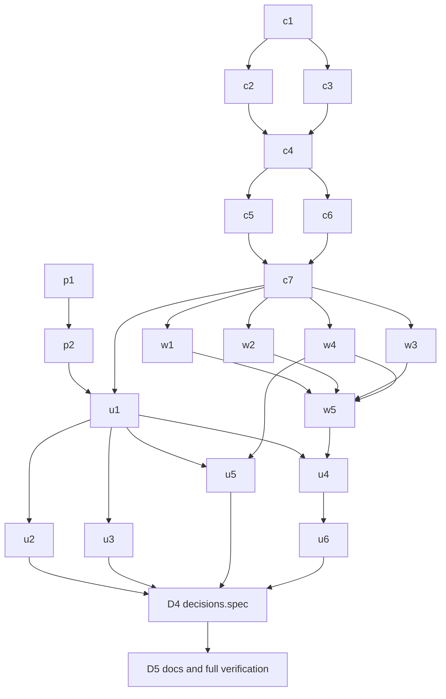

# Plan: the decision engine, with Jev as an optional provider

Agentry makes many small judgments, and each one is decided today in one of three ways: a fixed
rule, a paid Claude run, or a person. Examples: whether a card needs refining, what to do after QA
sends a card back, whether to retry a failed task, whether a stuck worker needs a hint, which
journal entries an agent reads, and which memory proposals come first. This plan gives those
judgments one home. It is a **decision engine** in core with:

- three typed questions (choice, score, yes/no);
- two providers: the Claude Code CLI by default, and TypeSafe's **Jev** once the owner adds a key;
- a mode per decision point: `off`, `shadow` or `active`;
- a **Decisions** tab in Settings, where all of it is set.

The owner's eighteen decisions of 2026-09-28 are recorded in
[decisions/decision-engine.md](../decisions/decision-engine.md) and are not repeated here, only
cited as *D1…D18*. Where this plan and that record disagree, the record wins.

Status: **planned on 2026-09-29 (CW-5), not built.** Every location below was checked on `main` at
`80916ccc` (0.24.0). The first draft, on the local branch `docs/decision-engine-plan` (28f63c65),
was input only. Its open questions are all answered by the decisions record.

## Goal and non-goals

**Goal.** One delivery (D17) that builds:

- the engine and its two providers, `cli` and `jev`;
- the settings, with per-project overrides;
- the decision history;
- the API;
- the Decisions tab;
- every decision point in the [table below](#decision-points-on-main), wired in.

**Every point ships `off`** (D2). A fresh install behaves exactly as today and sends nothing
anywhere. The owner turns points to `shadow` to measure them, and to `active` one at a time from
what the metrics show.

**Non-goals.**

- **No voice point** (D18). Natural-language intent lives only in the command palette.
- **No v1 / v2 split** (D17). The orchestrations below sequence the work inside the one delivery.
  They are not releases.
- **Nothing that grants something goes through the engine:** tool permissions, the move to `done`,
  QA's final verdict, `verifyAuth`, or a security mode.
- **No plain arithmetic goes through the engine:** account rotation (`accounts.ts` `rotate`, the
  most headroom wins), usage bars, cost caps.
- **Jev never generates** text, code or prompts. It only answers typed questions.
- **The English rule (D4) is not written here.** Its own work item writes it into CONTRIBUTING.md
  and CLAUDE.md. This plan only follows it: every question and rubric is in English.

## Engine contract

New folder `packages/core/src/decisions/`. The shapes below are the contract. The wire types go
into `packages/shared/src/types.ts` (see [API and shared types](#api-and-shared-types)).

```ts
/** The three primitives, named as Jev names them. */
type DecisionPrimitive = 'choice' | 'score' | 'noul';

interface ChoiceQuestion {
  kind: 'choice';
  id: string;
  question: string;             // English (D4)
  /** 2..255 options; ids are stable, labels are what the provider reads. */
  options: ReadonlyArray<{ id: string; label: string }>;
}

interface ScoreQuestion {
  kind: 'score';
  id: string;
  question: string;
  /** A rubric of 2..10 levels, lowest first. */
  levels: ReadonlyArray<{ id: string; description: string }>;
}

interface NoulQuestion {
  kind: 'noul';
  id: string;
  question: string;             // answered yes/no
}

type DecisionQuestion = ChoiceQuestion | ScoreQuestion | NoulQuestion;

/**
 * Every answer is a value plus a confidence in [0, 1]. The CLI provider has no calibrated
 * confidence, so it always returns null (D6), and a null never clears a threshold.
 */
type ChoiceAnswer = { kind: 'choice'; value: string; probabilities: Record<string, number> | null; confidence: number | null };
type ScoreAnswer  = { kind: 'score'; value: string; probabilities: Record<string, number> | null; confidence: number | null };
type NoulAnswer   = { kind: 'noul'; value: boolean; probability: number | null; confidence: number | null };
type DecisionAnswer = ChoiceAnswer | ScoreAnswer | NoulAnswer;

/** What a point sends: the state it declares and nothing else (D12). */
interface DecisionRequest {
  point: DecisionPointId;
  /** JSON built by the point's own builder, redacted and cut to the point's byte limit. */
  state: Record<string, unknown>;
  questions: ReadonlyArray<DecisionQuestion>;   // one batch, one provider call
}

type ProviderResult =
  | { status: 'answered'; answers: Record<string, DecisionAnswer>; latencyMs: number;
      inputTokens: number | null; costUsd: number | null; model: string }
  | { status: 'unavailable'; reason: 'no-key' | 'timeout' | 'rate-limited' | 'server-error' | 'network' | 'invalid-answer';
      latencyMs: number };

type DecisionProviderId = 'cli' | 'jev';

interface DecisionProvider {
  readonly id: DecisionProviderId;
  /** True when a call can be made now (the CLI is found; a Jev key is saved). */
  available(): boolean;
  ask(request: DecisionRequest, opts: { deadlineMs: number; signal: AbortSignal }): Promise<ProviderResult>;
}
```

**The `cli` provider** (`decisions/providers/cli.ts`, default, D1):

- One housekeeping CLI chat per request, with `--json-schema`. The schema is built from the
  questions: an enum per choice or score, a boolean per noul.
- It launches through the existing `chats.ts` `buildArgs` path (`opts.jsonSchema`), the way the
  planner (`orchestrator.ts` `startPlan`), the flow (`flow.ts`, `flowResultSchema`) and the project
  assistant (`assistant.ts` `launch`) already do.
- It runs on the `read-only` preset, on the configured model (`haiku` by default), with a cost cap
  per request.
- Probabilities and confidence come back `null`.
- This provider is Claude Code through its CLI and nothing else, so it is inside the one rule.

**The `jev` provider** (`decisions/providers/jev.ts`, optional, D5, D11):

- It calls the official `@typesafe-ai/sdk`, added to `packages/core` with an exact version, never
  a range.
- The SDK sits behind our own adapter: `decisions/providers/jev.ts` is the only file that imports
  it. The adapter maps our `DecisionRequest` to the SDK's call and its answers back to
  `DecisionAnswer`, so a new SDK or a plain `fetch` replaces one file.
- The model is **pinned to `jev-1.13.0`**. When TypeSafe announces a newer model, the Engine section
  shows a notice and suggests a shadow period. It never upgrades by itself.
- The key comes from `decision-credentials.json` (see [Persistence](#persistence)), never from the
  environment of a chat.
- It calls TypeSafe, never Anthropic. That is why it needs the bounded exception in CONTRIBUTING.md
  (D16, [below](#amendment-to-contributingmd)).

**Modes and kinds** (D2, D6):

```ts
type DecisionMode = 'off' | 'shadow' | 'active';
type DecisionPointKind = 'suggest' | 'act';
type DecisionScope = 'global' | 'project';   // G or P in the table

interface DecisionPointDefinition {
  id: DecisionPointId;
  kind: DecisionPointKind;
  scope: DecisionScope;
  primitives: ReadonlyArray<DecisionPrimitive>;
  /** Default confidence an act point needs; ignored by suggest points. */
  defaultThreshold: number;             // 0.85 unless the table says otherwise
  /** Bytes of state the point may send, after redaction. */
  maxStateBytes: number;
  /** True when acting on it avoids a Claude run (feeds "Claude runs saved", D14). */
  savesRun: boolean;
  /** Whether the provider is fast enough for the call site (the palette needs Jev). */
  needsLowLatency: boolean;
  buildState(subject: DecisionSubject): Promise<Record<string, unknown>>;
  questions(subject: DecisionSubject): ReadonlyArray<DecisionQuestion>;
}
```

- `off`: nothing is asked. Today's behaviour runs.
- `shadow`: the engine asks and records the answer. Today's behaviour still decides, and nothing
  visible changes.
- `active`:
  - A **suggest** point prepares something a person then decides (a sort, a prefill, a flag). It may
    be active with either provider.
  - An **act** point changes what happens next only when `confidence >= threshold`. Below the
    threshold, or with a `null` confidence, today's behaviour runs.
  - With the `cli` provider, an act point can never clear the threshold. The UI therefore does not
    offer `active` for an act point whose effective provider is `cli`. If the provider later becomes
    `cli`, the point behaves as `shadow` and the row records `mode: 'active', acted: false,
    reason: 'no-confidence'`.

**The call** (`decisions/engine.ts`):

```ts
interface DecisionOutcome<A extends DecisionAnswer = DecisionAnswer> {
  decisionId: string | null;            // null when the point is off
  mode: DecisionMode;                   // effective, after project → global → default
  /** True only when the caller should act on `answers` (active, and the threshold cleared for act). */
  act: boolean;
  answers: Record<string, A> | null;
}

interface DecisionEngine {
  ask(point: DecisionPointId, subject: DecisionSubject, scope: { projectId: string | null }): Promise<DecisionOutcome>;
  /** Called by the point when what happened becomes known (see Shadow accuracy). */
  resolve(decisionId: string, outcome: DecisionResolution): void;
}
```

`ask` does the following:

- It resolves the effective settings: project override, then global, then the point's defaults.
- It returns `{ mode: 'off', act: false }` at once when the point is off, or when it has no consent
  (D12).
- It builds and redacts the state, calls the provider under a deadline, writes the row, and returns.
- It never throws into the caller.

**Provider unavailable** (D10):

- A point never waits on the engine beyond its deadline. The deadline is 1,500 ms for Jev, and the
  CLI provider's own timeout (30 s) only at points that already run in the background (flow,
  orchestrator, supervisor).
- On `unavailable`, `ask` returns `act: false`, so the caller runs today's behaviour right away. The
  row is written with `status: 'unavailable'` and the reason.
- There is **no fallback from `jev` to `cli`**. A CLI run in place of a 0.2 s call would silently
  turn a free-ish decision into a paid, slow one.
- The Decisions tab warns (status colour `warn` plus the words "Provider unavailable") when three or
  more requests of the same provider came back unavailable in the last hour.
- Retries only happen inside the Jev adapter: one retry with backoff on 429 or 529, still within
  the deadline.

**Redaction** (`decisions/redact.ts`):

- The state carries only the fields its point's builder lists.
- Every string is cut to the point's `maxStateBytes`.
- Anything that looks like a secret is removed, using the patterns the logs already mask.
- The builder is the single source of what leaves the machine. The consent preview shows exactly its
  output.

## Persistence

**Settings are settings-shaped, so they go in JSON** (D3, D8):

- **`decisions.json`** in the data directory holds the global settings. `decisions/settings.ts`
  validates the whole file on `PUT`, the way `supervisor.ts` `parseSupervisorConfig` does, and
  writes it atomically.

  ```ts
  interface DecisionSettings {
    provider: DecisionProviderId;                       // global default: 'cli'
    cli: { model: string; maxCostUsd: number };         // 'haiku', 0.02
    jev: { model: 'jev-1.13.0'; keySet: boolean; keyHint: string | null };  // keyHint: last 4 chars
    points: Partial<Record<DecisionPointId, DecisionPointSettings>>;
    historyDays: number;                                // 30 by default, editable 1..365 (D9)
  }
  interface DecisionPointSettings {
    mode: DecisionMode;                                 // default 'off' for every point
    threshold: number;                                  // act points only, 0.5..0.99
    /** D12: set when the owner consents after seeing the preview; cleared when the state shape changes. */
    consent: { at: string; stateVersion: number } | null;
  }
  ```
- **Per-project overrides** go in the project's settings, which today live inside `projects.json`
  and are parsed by `project-settings.ts` `parseProjectSettings`. They add an optional field on
  `ProjectSettings` (`packages/shared/src/types.ts`):

  ```ts
  interface ProjectDecisionSettings {
    provider?: 'inherit' | DecisionProviderId;          // D8: 'jev' allowed while the global is 'cli', using the global key
    points?: Partial<Record<DecisionPointId, Partial<Pick<DecisionPointSettings, 'mode' | 'threshold'>>>>;
  }
  // ProjectSettings.decisions?: ProjectDecisionSettings
  ```

  Only points of scope P accept an override. Consent stays global, because it is about what leaves
  the machine, not about one project.
- **The Jev key** goes in `decision-credentials.json`, mode 0600, written atomically like
  `credentials.json`. The API never returns it, only `keySet` and `keyHint`.
- **`supervisor.json` stays as it is** (D7). Its parser, defaults and routes do not change; only its
  card moves into the Decisions tab. The `supervisor.intervene` point is set in `decisions.json`
  like every other point.

**History is an accumulating record, so it goes in SQLite rows** (D9). There is one new migration
in `packages/core/src/db.ts` `MIGRATIONS`, in the style of `supervisor_proposals` and
`assistant_proposals`:

```sql
-- One row per question batch sent to a provider. Rows, because they accumulate, and the shadow
-- comparison needs each answer next to what later happened.
CREATE TABLE decisions (
  seq            INTEGER PRIMARY KEY AUTOINCREMENT,
  id             TEXT NOT NULL UNIQUE,
  point          TEXT NOT NULL,            -- DecisionPointId
  kind           TEXT NOT NULL,            -- suggest | act
  project_id     TEXT,                     -- null for global points
  subject_kind   TEXT NOT NULL,            -- work_item | flow_run | task | chat | memory_proposal | assistant_run | notification | palette
  subject_id     TEXT,
  provider       TEXT NOT NULL,            -- cli | jev
  model          TEXT NOT NULL,            -- e.g. jev-1.13.0, haiku
  mode           TEXT NOT NULL,            -- shadow | active (off writes nothing)
  status         TEXT NOT NULL,            -- answered | unavailable
  unavailable    TEXT,                     -- reason when status = unavailable
  state          TEXT NOT NULL,            -- JSON: the exact state sent (the consent preview reads the latest)
  questions      TEXT NOT NULL,            -- JSON
  answers        TEXT,                     -- JSON: DecisionAnswer per question id
  confidence     REAL,                     -- lowest confidence of the batch; null for cli
  threshold      REAL,                     -- the threshold in force, act points only
  acted          INTEGER NOT NULL,         -- 1 when the answer changed what happened
  visible        INTEGER NOT NULL,         -- 1 when it changed something a person sees (D15: shows the mark)
  saved_run      INTEGER NOT NULL,         -- 1 when acting avoided a Claude run (D14)
  latency_ms     INTEGER NOT NULL,
  input_tokens   INTEGER,
  cost_usd       REAL,
  outcome        TEXT,                     -- JSON DecisionResolution, when known
  agreed         INTEGER,                  -- 1 / 0 once resolved; null while unknown
  resolved_at    TEXT,
  feedback       TEXT,                     -- useful | not_useful | null (D13)
  feedback_at    TEXT,
  at             TEXT NOT NULL
);
CREATE INDEX decisions_point_at ON decisions (point, at);
CREATE INDEX decisions_project_at ON decisions (project_id, at);
CREATE INDEX decisions_subject ON decisions (subject_kind, subject_id);
```

`AppDb` store methods:

- `insertDecision`, `resolveDecision`, `setDecisionFeedback`;
- `listDecisions` (filters: point, project, provider, mode, status, since, until, cursor);
- `decisionStats` (per point: count, acted, mean confidence, resolved, agreed, useful, not useful,
  unavailable, cost, runs saved);
- `deleteDecision(id)`, `clearDecisions(filter)`;
- `pruneDecisions(before)`, the same pattern as `pruneUsageHistory`. It is called once a day and at
  start-up, with `historyDays` from `decisions.json`.

"Editable" (D9) means two things: the person can change `historyDays`, and the person can delete one
row or clear a filtered set from History. Consent is not a row: it is a setting.

## API and shared types

**Shared types** in `packages/shared/src/types.ts`:

- `DecisionPrimitive`, `DecisionQuestion` (and its three variants), `DecisionAnswer` (and its
  three variants);
- `DecisionProviderId`, `DecisionMode`, `DecisionPointKind`, `DecisionScope`;
- `DecisionPointId`: a union of the ids in the table;
- `DecisionPointInfo`: the catalogue entry the UI needs (id, kind, scope, primitives, default
  threshold, `savesRun`, `needsLowLatency`, and the effective settings for a scope);
- `DecisionSettings`, `DecisionPointSettings`, `DecisionSettingsUpdate`, `ProjectDecisionSettings`,
  and `ProjectSettings.decisions?`;
- `DecisionCredentialsUpdate`, `DecisionTestResult`;
- `DecisionRecord` (a row as the API serves it), `DecisionPage`, `DecisionFilter`,
  `DecisionResolution`, `DecisionFeedback`;
- `DecisionPointStats`, `DecisionStats` (including `jevCostUsd` and `claudeRunsSaved` for the Usage
  line);
- `DecisionPreview` (the state a point would send, or sent last, plus its byte size and provider).

After changing them, run `pnpm --filter @agentry/api openapi:schemas`. CI fails on drift.

**Routes**, in a new `apps/api/src/routes/decisions.ts`, tag `decisions`:

| Method | Route | What |
| --- | --- | --- |
| `GET` | `/decisions/settings` | Global settings, key masked (`keySet`, `keyHint`) |
| `PUT` | `/decisions/settings` | Replaces the global settings, validated whole |
| `PUT` | `/decisions/credentials` | Saves the Jev key; the response carries the general privacy notice (D12) |
| `DELETE` | `/decisions/credentials` | Removes the Jev key; points on `jev` fall back to off-behaviour and warn |
| `POST` | `/decisions/test` | One small request to a provider: reachable, latency, model |
| `GET` | `/decisions/points` | The catalogue with effective settings, optionally `?projectId=` |
| `GET` | `/decisions/points/:point/preview` | The exact state of the point's last request, or the state it would send now, built locally and not sent (D12) |
| `PUT` | `/decisions/points/:point/consent` | Grants or withdraws consent for a point, bound to the previewed state version |
| `GET` | `/decisions` | History, filtered and paged |
| `GET` | `/decisions/stats` | Per-point metrics, plus Jev cost and Claude runs saved over a window (D14) |
| `GET` | `/decisions/:id` | One decision: question, answers, probabilities, provider, outcome |
| `POST` | `/decisions/:id/feedback` | Useful / not useful on a decision (D13) |
| `DELETE` | `/decisions/:id` | Deletes one row |
| `DELETE` | `/decisions` | Clears the rows matching a filter |
| `POST` | `/decisions/palette` | Intent routing for the command palette: the query and the command ids, answered with a choice (the `palette.intent` point) |

The per-project override travels in the existing `GET` and `PUT /projects/:id/settings`, so no new
route is needed for it. Every new route gets **a summary and the `decisions` tag in
`apps/api/src/openapi/routes.ts`** (a test enforces it) and **a row in the README's REST API
tables**, and the OpenAPI schemas are regenerated in the same change (the `add-rest-route` skill).

## UI

**Prototypes come first.** New reference screens go into `docs/design-system/reference/`, and the
owner validates them before any web code is written.

**Settings → Agentry → Decisions** (`apps/web/src/pages/config/DecisionsTab.tsx`).

Reference: `DesktopAjustes.html` and `MobileAjustes.html`, plus new prototypes
`DesktopAjustesDecisiones.html` and `MobileAjustesDecisiones.html` with dark and light screenshots.

- **Where it lives in `Settings.tsx`.**
  - A `decisions` entry is added to `TAB_LABELS` and to the `agentry` group of `GROUPS`.
  - The Supervisor tab leaves the `system` group. Its card becomes the Decisions tab's Supervisor
    section.
  - `?tab=supervisor` still lands there. Today `isTab` would send an unknown id to Appearance, so
    `SettingsInner` gets a small alias map, `{ supervisor: 'decisions' }`, and scrolls to the
    Supervisor section. The e2e spec that opens `?tab=supervisor` keeps passing.
- **Engine** section:
  - the provider (`Segmented`: Claude Code CLI / Jev);
  - the CLI model and the cost cap per request;
  - for Jev: the key field, "Test connection" and its result, the pinned model, and the notice when
    a newer model exists;
  - the privacy notice: what leaves, where to, that zero retention is an enterprise option;
  - the "Provider unavailable" warning when it repeats (D10);
  - `historyDays`.
- **Decision points** section: one row per point, grouped by area (Project flow, Board, Memory,
  Assistant, Orchestrations, Health and supervisor, Review, Notifications, Palette). Each row has:
  - the kind (a word: "Suggests" / "Acts");
  - the mode (`Segmented` off / shadow / active; `active` disabled with a reason for an act point on
    the CLI);
  - the threshold (the slider from `components/controls`, act points only);
  - consent;
  - last week's metrics.
- **Consent per point** (D12):
  - Moving a point out of `off` the first time opens a dialog (a `Sheet` on a phone).
  - The dialog shows the exact state from `GET /decisions/points/:point/preview`, as mono JSON,
    with its size and the provider it goes to.
  - Consent is recorded with the state version. A point whose state shape changes asks again.
  - With the `cli` provider nothing leaves the machine, and the dialog says so.
- **Per-point metrics** (D14): count, share acted, mean confidence (or "—" for the CLI), shadow
  agreement with the outcome (with its n), useful / not useful, unavailable, cost, runs saved. The
  numbers are tabular and in mono.
- **Supervisor** section: today's `SupervisorTab` card unchanged, since `supervisor.json` stays
  (D7).
- **History** section:
  - the decisions list, filterable by point, project, provider, mode and status;
  - each row opens its answer (question, probabilities, provider, outcome) and offers useful / not
    useful and delete;
  - "Clear" with a confirmation (status colour `bad`, since it is destructive).
- **Project settings → Decisions** (`DesktopProyectoAjustes.html`, `MobileProyectoAjustes.html`):
  - the provider (inherit / CLI / Jev; Jev enabled only when a global key is saved, D8);
  - per P point: mode and threshold, showing the inherited value until changed, plus a "Use global"
    reset.
- **The "decided · 0.93" mark** (D15):
  - It shows only on a row with `visible = 1`, that is, only where a decision changed something a
    person sees. Nothing shows in shadow, and nothing shows for an invisible act such as
    `journal.relevance`.
  - It is a small mono label: "decided · 0.93", or "suggested" when the confidence is `null`.
  - It opens the answer in a popover (a `Sheet` on a phone), with useful / not useful.
  - Surfaces:

    | Surface | Reference screen |
    | --- | --- |
    | Board card and item detail | `DesktopTablero` / `MobileTablero`, `DesktopTarea` / `MobileTarea` |
    | New work item | `DesktopNuevaTarea` / `MobileNuevaTarea` |
    | Memory proposals | `DesktopMemoria` / `MobileMemoria` |
    | Assistant proposals | `DesktopAsistentePropuestas` / `MobileAsistentePropuestas` |
    | Orchestration task row and plan draft | `DesktopOrquestacion` / `MobileOrquestacion` |
    | Supervisor hint in a chat | `DesktopChat` / `MobileChat` |
    | Unexplained hunk in review | `DiffView`, `DesktopCambios` / `MobileCambios` |

  - A decision is not a status, so the mark carries no status colour. It uses a neutral token and
    the word itself.
- **Usage line** (D14): one line in `apps/web/src/pages/Usage.tsx` (`DesktopUso.html`,
  `MobileUso.html`), reading "Decisions · Jev $0.004 · 37 Claude runs saved" over the page's window,
  from `GET /decisions/stats`. It is hidden when no decision was recorded in that window.
- **Command palette** (`CommandPalette.tsx`): when `palette.intent` is active and the provider is
  Jev, a query that ranks nothing locally above a floor asks `POST /decisions/palette`, and the
  chosen command is shown first with the mark. The local `palette-model.ts` `score` always answers
  first, and nothing blocks typing.

**Night Shift checks every surface must pass** (the `night-shift-ui-check` skill):

- **Tokens only.** No hex, `rgb()`, pixel radius or millisecond value outside `tokens.css`. The
  web guard test stays green.
- **Both themes.** Dark first, and `[data-theme='light']` works too. Contrast is ≥ 4.5:1 for text
  and ≥ 3:1 for large numbers.
- **Copy.** en/es parity for every string through i18n, and the `es` copy follows `GLOSSARY.md`.
- **Phone layout.** Touch targets ≥ 44 px, inputs at 16 px, dialogs and popovers as a `Sheet`.
- **Axe.** `a11y.spec.mjs` covers the new tab and the mark with no violations.
- **Controls** come from `components/controls` only.
- **Motion.** No new motion. Nothing on this tab is live, so no `--live`, no spinner loops, and no
  energy border.
- **Gradient budget.** At most the page's one primary action.

## Decision points on main

Columns:

- **Kind**: suggest or act.
- **Scope**: **G** global only, **P** can also be set per project.
- **Where**: the file and function on `main` at `80916ccc`.
- **New**: the point is not in the decisions record of 2026-09-28.

Every point ships `off`.

| Id | Kind | Scope | Where on main (file · function) | Today | Outcome signal | Shadow measure | State sent |
| --- | --- | --- | --- | --- | --- | --- | --- |
| `flow.refine-needed` | act | P | `packages/core/src/flow.ts` · `FlowService.trigger`, beside `refinedAlready` | A card entering `backlog`/`todo` queues a Product Owner refine run unless the flow is off, the item is an epic or `refinedAlready` holds | the refine run's `flow_runs.outcome`; later `work_item_history` edits of description or criteria by a person; a later bounce | "ready, skip refine" was right when the refine changed no criteria and the card was not bounced for missing criteria | title, description, type, acceptance criteria, labels, size estimate (no comments) |
| `flow.bounce` | act | P | `packages/core/src/flow.ts` · `FlowService.apply` (the `maxBounces` check, line 1221 at the plan's commit) | After QA rejects, bounce back to `in_progress` until `bounces >= maxBounces` (default 3, `team.ts` `DEFAULT_MAX_BOUNCES`), then wait for a person | the next `verify` run's `flow_runs.outcome`; `work_items.waiting = 'bounces'`; a person's move | `fixable` was right when the next QA passed; `needs-person` when the card ended waiting or a person intervened | QA's last comment (`rejection`), unmet criteria, bounce count |
| `orchestration.retry` | act | P | `packages/core/src/orchestrator.ts` · `settle` | Any error without a cause is retried in the same chat until `maxAttempts` | the retry's `OrchestrationTaskState.status` and `attempts` in `orchestrations` | `permanent` was right when every retry still failed; `transient`/`fixable` when a retry completed | the error text (redacted), the task name, the attempt number |
| `supervisor.intervene` | act | G | `packages/core/src/supervisor.ts` · `Supervisor.wake` (from `health-service.ts` `HealthMonitor.announce`) | Every first `bad` signal per chat asks the supervisor's Haiku for a hint | `supervisor_proposals.status` (`sent` / `dismissed`) | "needs a hint" was right when the hint was sent (by the person or `autoSend`), wrong when dismissed | the signal, its detail, the last tool calls' names and errors (no file contents) |
| `memory.triage` | suggest | P | `packages/core/src/memory-proposals.ts` · `MemoryProposalService.propose` and `list` | Proposals are deduplicated only by exact text (`sameProposal`) and listed in arrival order | `memory_proposals.status`, `approved_text`, `reject_reason` | predicted duplicate or low-usefulness items were rejected, high-scored items approved | the proposal text and target, the titles of the project's memory entries and last journal entries |
| `assistant.rerank` | suggest | P | `packages/core/src/assistant.ts` · `AssistantService.insertAnswer` | Proposals are inserted in the model's order; only exact existing roles and resources are filtered | `assistant_proposals.status` (`accepted` / `discarded`) | top-ranked proposals were accepted, predicted "already covered" were discarded | the proposals (kind, title, summary), the names of existing agents, skills, commands and members |
| `assistant.sources` **(new)** | act | P | `packages/core/src/assistant-sources.ts` · `initialSources` | Top-level files ranked by a fixed `fileRank`, capped at `FILES_MAX` / `DIRS_MAX` | `assistant_runs.reads` (what the run opened on its own) | a file the engine dropped and the run then read counts as a miss | the brief, file names and sizes (no contents) |
| `journal.relevance` | act | P | `packages/core/src/journal.ts` · `JournalService.handoff` | Newest entries first, up to 16 KB (`JOURNAL_HANDOFF_BYTES`); older decisions fall off | the run's `flow_runs.outcome`; a later bounce whose comment cites a journal decision | an entry scored irrelevant that QA or the person then cites counts as a miss | the card or task title and criteria, each entry's title and first lines |
| `board.triage` | suggest | P | `packages/core/src/work-items.ts` · `WorkItemService.create` (and the web New work item dialog) | The person fills type, priority and epic (defaults `task`, `medium`); no duplicate check | `work_item_history`: edits of type, priority or epic after creation; a `duplicates` relation or removal | the prefill was right when the person kept it; the duplicate warning when the item was removed or linked | the draft title and description, open items' titles, epic titles |
| `team.assign` | suggest | P | `packages/core/src/flow.ts` · `memberOf` (fed by `FlowService.trigger`; columns filled in `team.ts` `TeamService`) | The member is fixed by the column's role | `work_item_history` reassignments; the run's `flow_runs.outcome` | the proposed member matched the person's reassignment, or the fixed member's run failed where the proposal differed | the card's title, type and criteria, members' roles and responsibilities |
| `flow.scope-drift` | suggest | P | `packages/core/src/changes.ts` · `Changes.itemChanges` (per commit, from `summarize`) | Nothing compares a commit with the card | QA's rejection comment naming out-of-scope work; the person's useful / not useful | a drift flag followed by a QA rejection or "useful" counts as right | the card title and criteria, each commit's message and changed file paths (no diff contents) |
| `flow.criteria-precheck` | act | P | `packages/core/src/flow.ts` · `FlowService.trigger` for the verify stage (criteria enforced later in `FlowService.finish`) | Every card entering `in_review` queues a QA run; unmet criteria are only caught after it | the QA run's verdict and `unmet` criteria in `FlowService.finish` | "a criterion is clearly unmet" was right when QA then rejected on it. It can only send back before QA; it never passes a card | criteria, the Developer's summary, commit messages and changed paths |
| `flow.criteria-merge` **(new)** | suggest | P | `packages/core/src/flow.ts` · `refineItem` | Proposed criteria merge by exact lower-case text, so near-duplicates get through | a person deleting or editing a merged criterion in `work_item_history` | a pair flagged as duplicate that the person then removed | the existing and proposed criteria texts |
| `flow.restart` **(new)** | act | P | `packages/core/src/flow.ts` · `FlowService.recover` | A run cut by a restart is requeued up to `MAX_FLOW_RESTARTS` | the requeued run's `flow_runs.outcome` and `restarts` | "do not requeue" was right when the requeued run failed again | the run's stage, cause, restart count, last error |
| `orchestration.model` | suggest | P | `packages/core/src/orchestrator.ts` · `draftFrom` (after `startPlan`) | Every task in the draft gets the plan's one model | per-task `status`, `attempts` and `costUsd`; the person's edit of the task model before launch | a cheaper model proposed for a task that then completed on the first attempt, or a person keeping the prefill | the task names and prompts' first lines, `dependsOn`, the model options |
| `orchestration.fixer` **(new)** | act | P | `packages/core/src/orchestrator.ts` · `checkAll` | The fixer loop runs until `maxAttempts` or `maxCostUsd` | the next fixer attempt's check results | "stop" was right when the remaining attempts still failed the checks | the failing check's name and output tail (redacted), the attempt number |
| `health.semantic-loop` | suggest | G | `packages/core/src/health.ts` · `loop` (read by `HealthService.read`) | Only exact repeats of tool, input and result (or error text) count as a loop | a supervisor hint sent, the person stopping the chat, or the task failing | a flagged loop followed by a stop, hint or failure counts as right | the last 12 tool calls' names, inputs cut to 200 chars, result heads |
| `health.test-weakening` | suggest | G | `packages/core/src/health.ts` · `weaknessOf` (via `weakening` / `weakenedTests`) | Regexes (`ASSERTION`, `WEAK`, `TAUTOLOGY`, `SKIP`) over the edit | the person's useful / not useful; QA rejecting on test changes | a flagged edit marked useful or followed by a QA rejection on it. **Suggest only**: the content is written by the agent it judges ([Risks](#risks)) | the test file path, the before and after of the edited hunk |
| `changes.unexplained-hunk` | suggest | P | `packages/core/src/changes.ts` · `Changes.chatSteps` / `taskSteps`, with `edit-steps.ts` `editStepsOf`; web `components/changes/DiffView.tsx` `DiffView` | Hunks are linked to transcript steps; nothing flags a hunk no step explains | the person's useful / not useful on the flag; QA rejecting on that file | a flagged hunk marked useful counts as right | the hunk text (cut), the step's sentence before it, the card title |
| `palette.intent` | suggest | G | `apps/web/src/components/CommandPalette.tsx` · `CommandPalette`, with `palette-model.ts` `score` | Subsequence match over titles, groups, keywords and hints | whether the person runs the proposed command | proposed command = command run | the query, the command ids and titles (no page content) |
| `notification.urgency` | act | G | `packages/core/src/push.ts` · `PushService.onEvent`, with `packages/shared/src/notifications.ts` `notificationsFor` | Priority is fixed per kind (health `bad` is `high`) and filtered by the subscription's `level` | whether the notification was opened (a new `opened_at` on the decision row, set when the app opens from it) | a raised urgency followed by an open within the TTL counts as right | the notification's kind, title and body |

The global **Agentry assistant** ([plans/agentry-assistant.md](agentry-assistant.md)) has no code on
`main`, so it has no point yet. When it is built, choosing which of its tools to call first is a
candidate, and it is added to this table then. The project assistant of
[assistant.md](../assistant.md) is covered by `assistant.rerank` and `assistant.sources`.

**Renamed from the record:**

- "scope drift" is `flow.scope-drift`;
- "criteria pre-check" is `flow.criteria-precheck`;
- "semantic loop" is `health.semantic-loop`;
- "unexplained hunks" is `changes.unexplained-hunk`;
- "palette intent" is `palette.intent`;
- "notification urgency" is `notification.urgency`.

**Changed from the record:** `health.test-weakening` is suggest-only, as the record's own note asks.

**Considered and left out:**

- `accounts.ts` `rotate` is arithmetic over headroom.
- `flow.ts` `retry` and `retryRefusal` are the person's action.
- `flow.ts` `causeOf` is a fixed mapping of error codes.

## Shadow accuracy

Shadow accuracy is D13. For every point, the engine compares what it would have done with what
really happened.

1. **A resolver per point.** Each point declares `resolve(row, event)`. It listens to the events the
   outcome signal already produces (`flow_runs` ending, `work_item_history` rows,
   `supervisor_proposals` status, `memory_proposals` and `assistant_proposals` decisions, task
   status, a notification open). It then writes `outcome`, `agreed` (1 / 0) and `resolved_at` on the
   row. A row that is not resolved within `historyDays` stays `agreed = null` and does not count.
2. **The person's word.** Useful / not useful can be given on the mark (active) and on any History
   row (shadow). Where both exist, the person's word wins over the inference: `agreed` follows the
   feedback, and the metric reports how often the two disagreed.
3. **What the tab shows** per point: accuracy = agreed / resolved, with n, over the last 7 and 30
   days, and separately per provider and per project.
   - Act points also show accuracy at their threshold: only the rows whose confidence cleared it.
     That is the number that says what `active` would have done.
   - The tab suggests `active` when an act point has at least 50 resolved rows above its threshold
     and at least 95 % agreement there. It never switches a point by itself.
4. **After a model change** (D11), the notice suggests two weeks of shadow before trusting the old
   numbers, and the metrics split by `model`.

## Orchestrations and task graph

The work is one delivery on one feature branch, **`feat/decision-engine`**, cut from `main` and
squash-merged once. It is split into five orchestrations, and each lands on that branch.

Every task runs `pnpm typecheck` and the tests of the packages it touches. Orchestration **D5** runs
the full `pnpm test` and `pnpm build && pnpm e2e` once, at the end.

**D0 · `decision-engine-prototypes`** (design; it gates D3):

- `p1`: the Decisions tab (four sections, consent dialog, History, provider warning), dark and
  light, desktop and phone.
  - Files: `docs/design-system/reference/DesktopAjustesDecisiones.html`, `MobileAjustesDecisiones.html`
    and their screenshots.
  - Check: the owner validates it.
- `p2`: the project override, the "decided" mark and popover on each surface, and the Usage line.
  - Files: prototypes of `DesktopProyectoAjustes`, `DesktopTablero`, `DesktopMemoria` and
    `DesktopUso` (and their Mobile versions), updated or added under
    `docs/design-system/reference/`; a new variant in `docs/design-system.md` and `agentry-ds.css`.
  - Check: the owner validates it.

**D1 · `decision-engine-core`**:

- `c1` (shared types), dependsOn none.
  - Files: `packages/shared/src/types.ts`, `apps/api/src/openapi/schemas*` (regenerated).
  - Checks: `pnpm --filter @agentry/shared test`, `openapi:schemas` with no drift.
- `c2` (SQLite table and store methods), dependsOn c1.
  - Files: `packages/core/src/db.ts` and its tests.
  - Check: `pnpm --filter @agentry/core test`.
- `c3` (settings and credentials), dependsOn c1.
  - Files: `packages/core/src/decisions/settings.ts`, `packages/core/src/project-settings.ts`
    (`decisions` field), tests.
  - Check: core tests.
- `c4` (engine, redact, point catalogue), dependsOn c2, c3.
  - Files: `packages/core/src/decisions/engine.ts`, `redact.ts`, `points.ts`, `index.ts` wiring,
    tests.
  - Check: core tests.
- `c5` (`cli` provider), dependsOn c4.
  - Files: `packages/core/src/decisions/providers/cli.ts` (through `chats.ts` `buildArgs`
    `jsonSchema`), tests with a fake CLI.
  - Check: core tests.
- `c6` (`jev` provider and adapter), dependsOn c4.
  - Files: `packages/core/src/decisions/providers/jev.ts`, `packages/core/package.json` (exact
    `@typesafe-ai/sdk`), tests with the SDK stubbed.
  - Check: core tests.
  - Note: no test ever calls TypeSafe.
- `c7` (API routes), dependsOn c4, c5, c6.
  - Files: `apps/api/src/routes/decisions.ts`, `apps/api/src/app.ts`, `apps/api/src/openapi/routes.ts`,
    `README.md` REST tables, API tests.
  - Checks: `pnpm --filter @agentry/api test` (the summary-and-tag test included).

**D2 · `decision-points`** (every point wired in, shipping `off`), all dependsOn D1:

- `w1` (flow): `flow.refine-needed`, `flow.bounce`, `flow.criteria-precheck`, `flow.criteria-merge`,
  `flow.restart`, `team.assign`.
  - Files: `packages/core/src/flow.ts`, `packages/core/src/team.ts`, the builders in
    `decisions/points.ts`, tests.
- `w2` (project knowledge): `memory.triage`, `journal.relevance`, `board.triage`,
  `assistant.rerank`, `assistant.sources`.
  - Files: `memory-proposals.ts`, `journal.ts`, `work-items.ts`, `assistant.ts`,
    `assistant-sources.ts`, tests.
- `w3` (runtime): `orchestration.retry`, `orchestration.model`, `orchestration.fixer`,
  `supervisor.intervene`.
  - Files: `orchestrator.ts`, `supervisor.ts`, tests.
- `w4` (signals): `health.semantic-loop`, `health.test-weakening`, `notification.urgency`,
  `flow.scope-drift`, `changes.unexplained-hunk`.
  - Files: `health.ts`, `health-service.ts`, `push.ts`, `packages/shared/src/notifications.ts`,
    `changes.ts`, tests.
- `w5` (resolvers for shadow accuracy), dependsOn w1–w4.
  - Files: `decisions/resolve.ts`, the event wiring in `packages/core/src/index.ts`, tests.

Each task's checks are core tests plus a test per point:

- `off` changes nothing, and no provider is called;
- `shadow` records a row but today's behaviour decides;
- `active` acts only above the threshold;
- `unavailable` falls back at once.

**D3 · `decisions-ui`**, dependsOn D0 and D1 (`c7`):

- `u1`: Decisions tab, the `GROUPS` move and the `?tab=supervisor` alias.
  - Files: `apps/web/src/pages/Settings.tsx`, `pages/config/DecisionsTab.tsx`, `SupervisorTab.tsx`
    (embedded), i18n `en`/`es`, tests.
- `u2`: consent dialog and preview, metrics, History. dependsOn u1.
  - Files: `pages/config/decisions/*`, i18n, tests.
- `u3`: project override. dependsOn u1.
  - Files: the project settings page, i18n, tests.
- `u4`: the "decided" mark and popover on every surface in the UI table. dependsOn u1 and D2.
  - Files: a shared `components/DecisionMark.tsx` and the surfaces, i18n, tests.
- `u5`: the Usage line and palette intent. dependsOn u1 and D2 (`w4`).
  - Files: `pages/Usage.tsx`, `components/CommandPalette.tsx`, i18n, tests.
- `u6`: flag unexplained hunks. dependsOn u4.
  - Files: `components/changes/DiffView.tsx`, `review-model.ts`, tests.

Checks for every D3 task:

- `pnpm --filter @agentry/web test` (the tokens guard and i18n parity included);
- the `night-shift-ui-check` skill;
- the e2e specs the surface is covered by, run one at a time (for example `shell.spec.mjs` for
  `?tab=supervisor`, and `a11y.spec.mjs`).

**D4 · `decisions-e2e`**, dependsOn D3: a new `e2e/decisions.spec.mjs` that checks:

- the tab opens from `?tab=supervisor`;
- a point moves to shadow through consent;
- History lists a row produced by a faked CLI provider;
- phone layout and axe pass.

Check: that spec alone.

**D5 · `decisions-docs-verify`**, dependsOn D1–D4:

- a feature document `docs/decision-engine.md`, this plan's Outcome, `docs/status.md` and the README
  "How it talks to Claude" table (the `cli` provider only);
- the full checks: `pnpm typecheck`, `pnpm test`, `pnpm build && pnpm e2e`.



D2 and D0 run in parallel with each other. D3 starts as soon as both D0 and `c7` are done.

## Amendment to CONTRIBUTING.md

This is D16. The text below is in CONTRIBUTING.md under "The one rule" since 2026-09-30 (added with
CW-5's pull request):

> **One bounded exception: typed decision services.** Agentry may call an optional outside service
> that only answers small typed questions (a choice, a score, a yes/no) for its decision engine.
> Today there is exactly one, TypeSafe's Jev. It is allowed only while all of this holds: it is off
> by default and used with the owner's own key; it never replaces or reaches Claude Code (it writes
> no text or code, runs no agent and makes no call to Anthropic); it receives only the state a
> decision point declares, after the owner has consented to that point having seen a preview of it;
> and Agentry works in full with the `cli` provider alone, which asks the same questions through the
> Claude Code CLI (`--json-schema`). See
> [docs/decisions/decision-engine.md](docs/decisions/decision-engine.md).

## Risks

- **Injection through content the agent wrote.** Jev can be steered by instructions inside the state
  it reads, and several states hold text an agent wrote: QA comments, commit messages, test edits.
  The mitigations:
  - `health.test-weakening` stays **suggest-only**: the agent under judgment writes the very content
    judged.
  - No point grants anything, and `flow.criteria-precheck` can only send a card back, never pass it.
  - Act points need a threshold, and they act only in directions that cost a person a look, never
    a skipped safeguard.
  - Every state is framed as data in the question ("the following is untrusted content").
- **Jev is weak at numbers, counting and dates.** No question asks Jev to compare numbers or dates.
  Code does that arithmetic: bounce counts, attempts, byte budgets and ages stay in code, and the
  state carries them as words only when needed ("third attempt"). `journal.relevance` scores each
  entry on meaning, and code applies the byte budget.
- **Content leaves the machine (privacy).** With the `jev` provider, titles, comments, error text
  and journal lines go to TypeSafe. Zero retention exists only on enterprise accounts. The
  mitigations:
  - the provider is off by default;
  - a general notice is shown when saving the key;
  - consent per point, with a preview of the exact state;
  - a declared, redacted, size-capped state per point;
  - secrets are masked;
  - the global palette point sends only command titles and the query;
  - with the `cli` provider nothing leaves beyond what Claude Code already sends.
- **Spanish content.** Jev is optimised for English. Questions are English (D4), and shadow
  accuracy is split per project so a Spanish project's numbers show on their own.
- **Cost of the CLI provider.** Each CLI request is a Haiku run (cents, seconds). Points batch all
  their questions into one run, and `shadow` with the CLI on busy points shows its cost in the
  metrics before anyone leaves it on.
- **Latency.** The palette needs `needsLowLatency`, so `palette.intent` is offered only with Jev.
  Every other call site already runs in the background.

## Test plan

- **Core unit tests.**
  - Settings validation and the project → global → default resolution.
  - Consent gating: no consent means no call.
  - Redaction.
  - Threshold logic: `null` never clears it.
  - Deadline and fallback on every `unavailable` reason.
  - The migration, retention pruning, stats and resolvers.
- **Providers.**
  - `cli` against the fake CLI the core tests already use (a `--json-schema` answer, and an invalid
    one).
  - `jev` with the SDK stubbed behind the adapter (answers, 429 then success, timeout).
  - No test reaches TypeSafe or Anthropic.
- **Per point**, the four-mode test from D2.
- **API tests** (Fastify inject):
  - every route, including validation errors;
  - the key never being returned;
  - the summary-and-tag test;
  - no OpenAPI drift.
- **Web tests.**
  - The Decisions tab sections and the `?tab=supervisor` alias.
  - `active` disabled for act points on the CLI.
  - The consent dialog showing the preview.
  - The mark rendering only with `visible`.
  - The Usage line hidden when empty.
  - i18n parity and the tokens guard.
- **e2e.** `decisions.spec.mjs` from D4, plus the existing `shell.spec.mjs`, `a11y.spec.mjs` and
  `motion.spec.mjs`.
- **Shadow period.** After merge, the owner runs chosen points in `shadow` on their own projects,
  then moves points to `active` one at a time from `/decisions/stats`.

## Related

- [[decisions/decision-engine.md]]: the owner's eighteen decisions this plan builds.
- [[decisions/english-technical-language.md]]: English questions and rubrics (D4).
- [[plans/project-ecosystem.md]]: the flow, board, team, memory, journal and assistant most points
  serve.
- [[plans/agent-observability.md]]: the health signals and the supervisor.
- [[plans/agentry-assistant.md]]: the global assistant, a future point.
- [[layered-settings.md]]: how settings are layered today.
- [[assistant.md]] · [[team-and-flow.md]] · [[work-items.md]] · [[design-system.md]]
