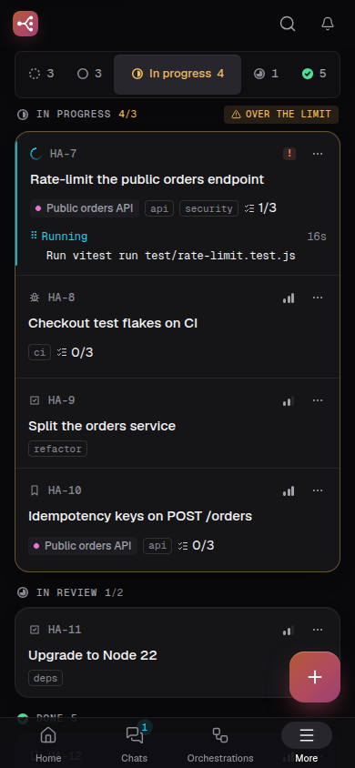
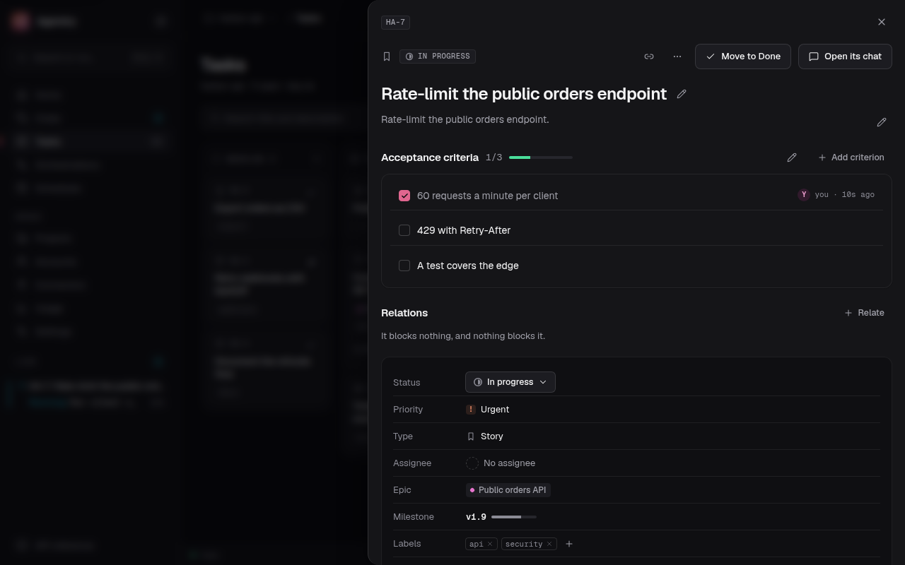

# Work items: the board, and what works on it

A project's **board** says what the project needs done. Each card is a **work item** (`AGN-12`), in
one of five fixed columns, and it keeps every chat and orchestration that worked on it. "Work on it"
starts a chat on an item in its own worktree, "Orchestrate" turns a selection into a graph, and
"Create a task from this message" turns a chat's message into an item; the item then moves by
itself as that work goes, within rules that never fight the person using the board.

Built by orchestration 1 of the [project ecosystem](plans/project-ecosystem.md) and fixed by 1b
after [its audit](plans/project-ecosystem-audit.md): the contract in `packages/shared`, the store in
`packages/core/src/work-items.ts` (with its rows in `work-item-rows.ts` and its checks in
`work-item-validation.ts`), the links and automation in
`packages/core/src/work-links.ts`, and the routes in `apps/api/src/routes/work-items.ts`.
Orchestration 2 (`ecosystem-board-web`) built the screens from the prototypes the owner validated on
2026-09-27: the board, the list, All projects, milestones, the item's page and panel, New task, and
the entry points in chats and orchestrations. See [The screens](#the-screens). Orchestration 3
(`ecosystem-team`) added a team of agents that works the board by column, documents tied to items
and the item's waiting state: see [team-and-flow.md](team-and-flow.md). Orchestrations 5
(`ecosystem-review-fixes`) and 6 (`ecosystem-gaps`) fixed the whole on 2026-09-28; what 6 changed is
marked with its gap's number from [the plan](plans/project-ecosystem.md#orchestration-6-ecosystem-gaps).
Orchestration 7 (`ecosystem-design`) brought the screens to the designer's official reference: the
card in five rows with a strip at its foot, failed runs told everywhere with a retry, and phone
screens that head themselves.

A board belongs to a project whose **Board** module is on; see [projects.md](projects.md).

## Why `WorkItem`

"Task" already means an orchestration task and a background command (`GET /tasks`), so the model is
`WorkItem` everywhere in code and the API. The interface says "Task" / "Tarea", and its routes are
`/tasks`.

## The model

Fixed on purpose, and not configurable:

- **Five columns**: `backlog`, `todo`, `in_progress`, `in_review`, `done`.
- **Four types**: `epic`, `story`, `task`, `bug`. One level of hierarchy: an epic groups items, has
  no epic itself, and an item that is not an epic has at most one epic, of the same project.
- **Four priorities**: `low`, `medium`, `high`, `urgent`. A priority is not a status: only `urgent`
  may be shown in a colour.
- **No time.** No due date, no estimate, no sprint. `createdAt`, `updatedAt` and `closedAt` are facts
  about what happened, never a plan.

The fixed orders live in `packages/shared/src/work-items.ts`, so core, the API's validation and the
web never disagree on them. Each is built with `valuesOf`, which checks the list against its union
both ways, so neither can grow without the other.

A work item has a key, type, title, Markdown description, status, priority, free labels, an assignee
(the person, or a team role of the project), an epic, a milestone, an **acceptance
checklist** (each entry checked on its own, recording who checked it), **relations** (`blocks` and
`blocked_by` only), comments by the person and by agents, its history, and its links. No attachments.

A project's settings name the types its board offers and an optional **limit per column**. Going
over a limit is allowed: the move succeeds and reports it, and the board shows the column in the warn
colour with a word. The store does not refuse a type the board does not offer; that list is for the
screens to draw.

**Epics do not count** (decided with the owner after the audit of orchestration 2, option B). An
epic groups work rather than being some, so a column's `count` leaves its epics out, and so does
every figure read from it: the open items beside Tasks in the sidebar and the More sheet, the
board's subtitle, the Board tab and the Overview's note on the project page, the column headers and
the phone's column jump. An epic never takes a place under a column's limit, and moving one never
puts a column over it. Epics stay on the board with their progress; the board redraws a moved epic
without touching the counts (`countsInColumn` in `apps/web/src/lib/work-items.ts`).

### Keys

Only an item's **number** is stored. It comes from a per-project counter that is never decremented,
so a number is never handed out twice inside a project, even after a delete. The key is composed on
every read from the project's current prefix (`workItemKey`), so changing the prefix renames every
key the store composes at once, history included. The id (a UUID) is what never changes.

What was written with a key before keeps the old one: an item's recorded branch (`task/<old key>`)
and worktree path, which "Work on it" goes on using so earlier work is not stranded; a chat's title,
which is its first prompt; the node ids of a draft; and a `/tasks/<old key>` address. Only the item's
id follows it everywhere.

### Milestones

A name (`v0.19`), a Markdown description, open or closed, and a progress figure derived from its
items, epics left out because they group work rather than being work. No date. Deleting a
milestone keeps its items, without it, and each records that in its history.

### Order inside a column

Each item has a `rank` inside its column, a fractional string compared byte by byte
(`packages/core/src/work-item-rank.ts`), so the order a person gives by dragging survives. A client
never sees or sends a rank: it moves an item by naming the item it goes after (`afterId`: `null` for
first, absent for last), so two people reordering at once do not collide. A move writes only the
moved row; a column whose ranks grow past 24 characters is respread inside the same transaction.

Appending to a column does not take the midpoint towards the end, which added a character every six
cards and respread a column filled from the bottom every 117 creates: it grows the first digit of the
last rank that can still grow, which adds a character every sixty. `rankBetween` checks that its
inputs are ranks and that its answer lies strictly between them, and throws otherwise; the store
then respreads the column, as it does for a rank grown too long.

## The rules the store keeps

`WorkItemService` has no HTTP in it, so every caller (the routes, the automation, a later agent) gets
the same rules:

- an epic has no epic, and an item's epic must be an epic of its project;
- a relation never points at its own item (400) nor closes a cycle of `blocks` (409, checked with a
  recursive query);
- a number is never reused;
- a move over a column's limit succeeds and says so;
- the actor is one of `person`, `agent` or `system`, with a role of at most 64 characters, and a
  stored kind this version does not know reads as `system`, never as the person (the automation asks
  the history whether the person moved an item, so a stray kind would freeze it);
- a comment is at most 50,000 characters, and asking for the comments of a missing item answers 404,
  like its history and its links;
- a link's `chatId`, `orchestrationId` and `taskId` are non-empty strings when present (400
  otherwise).

Search (`q`) and the label filter fold case in **every language**, not only ASCII: they are matched
in JavaScript on text folded through upper case and back, so `sesión` finds `SESIÓN` and `ß` matches
`ss`. Labels are de-duplicated on write with the same folding.

**History is written by the store, never by the caller**: one entry per field that changed, with the
actor (`person`, `agent` or `system`) and, when a chat or an orchestration did it, the cause (the
chat, the orchestration and task, and a stable event code a client translates). References in the
history (an epic, a milestone, a related item, a link) are snapshots, items by number, so an entry
still reads after a rename, a delete or a new prefix. A chat link is named by the chat's first prompt,
as the chat list titles it (`chatLinkName`), not by the session name the CLI was started with.
**A chat this process does not run** (the terminal chat an item was created from) had no title when
its link was written, and read "chat 1a2b…". The history is now read through the core, which looks
such a chat's title up in the chat list when the history is read, for
`GET /work-items/:itemId/history` and the item's page alike; a chat nobody can find keeps its label
(orchestration 6, gap 15).

**Several wrapper processes share the database**, so every write runs in `BEGIN IMMEDIATE`: it takes
the write lock before reading the counter or the neighbours' ranks. A deferred transaction would get
`SQLITE_BUSY` at the lock upgrade instead of waiting. A test runs four processes against one data
directory and checks the numbers and the ranks. When SQLite has already ended a failed transaction,
the `ROLLBACK` that follows fails too; that failure is swallowed so the caller sees the error that
caused it.

Storage is one migration at the end of `MIGRATIONS` in `packages/core/src/db.ts`: work items, labels,
criteria, relations, comments, history, links, milestones and the per-project counter, indexed by
project, status and rank. `db.ts` exports `migrate(db, until)` and `WORK_ITEMS_SCHEMA_VERSION`, so
the upgrade test builds the release before it without assuming this migration is the last.

## Access

Changing anything needs the project **imported and with its Board module on**; otherwise the routes
answer 409. Reads only need the project imported, so switching the module off never makes its items
look lost. Items of a project removed from Agentry stay readable by id but leave every list, and
nothing changes them until the directory is imported again (which takes the same project id back).

`GET /work-items` and `GET /work-items/board` are the **All projects** view: every item of the
imported projects with the Board module on, each naming its project. That board carries no column
limits, and its counts are recomputed over the projects it shows, leaving epics out as a project's
board does, so the sidebar's figure does not change with the scope.

A filter in a query string lists its values comma separated, or repeats its parameter
(`status=todo&status=done`); `q`, `epicId` and `milestoneId` take one value, and repeating them is a
400, as is any malformed body: none of these routes answers 500 to what a client sent.
`PATCH /work-items/:itemId` refuses `status` and `afterId` with 400, since only `/move` moves an item.

## Working on an item

### "Work on it"

`POST /work-items/:itemId/work` starts a chat in the item's project, prompted with its key, title,
description and acceptance criteria (`workItemPrompt`), with the options a new chat takes except the
prompt and the directory. The prompt's first line is `KEY · title`, since a chat is listed by the
first line of its first prompt and those are the person's own words in whatever language they wrote
them; the instructions for Claude after it stay in English (orchestration 6, gap 13).

The chat runs in the item's **own worktree**, on branch `task/<key>` in lower case, under
`<main checkout>/.claude/worktrees/task-<key>`, where the CLI keeps the worktrees it makes. It is made
the first time, locked so `git worktree prune` leaves it alone, and found again by every later chat
on the item. A project that is not a git repository, or has no commit to branch from yet, is worked
on in its directory.

- **Where it branches from**: the project's own HEAD, which for a project inside a linked worktree
  is not the main checkout's; or, when an orchestration node worked on the item first, the node's
  branch, so its work carries over. The main checkout of a submodule is the submodule's own
  checkout, not its git directory under the superproject's `.git/modules/` (`mainCheckout`). An
  orchestration's `--worktree` stays where `mainTopLevel` puts it, which is where the CLI looks.
- **Never a node's worktree.** "Retry clean" on a failed node force-removes its worktree and branch,
  so "Work on it" never works there: it makes the item's own `task/<key>` one instead, and nothing
  removes a worktree an item holds.
- **Deleted by hand**: git still holds the worktree, locked, and would refuse to check its branch out
  again. That one record is removed (`git worktree remove --force --force`, which only drops the
  record since the directory is gone) and the worktree is added again on the same branch, with its
  commits.
- **A plain directory** at that path, which git does not list as a worktree, is refused with 409:
  a chat running there would reach the main checkout with its git commands.
- **The branch checked out elsewhere** (another worktree holds `task/<key>`) is a 409 that says
  where, not git's own error as a 400.
- **Two projects of one repository** (its main checkout and a folder of it, say) can have the same
  key. The lock's reason names the project that made the worktree, and another project asking for
  the same path gets a 409 asking for another key prefix.

Refused: an epic (400); an item in `done` (409: nothing an agent does may take an item out of
`done`); an item a chat or a node is already working on (409). A draft and a launch that name the
item are refused the same way (`checkWorkable`). The start
options are checked for their type before any chat starts, and a wrong one is a 400 (before, a
number for `model` reached the CLI's arguments and failed as a 500). Of `mcp`, only the server names
are passed on, never a config path.

**A chat that fails to start for the server's reason answers 500** (orchestration 6, gap 17). The
runtime's deliberate refusals (no prompt, the concurrent run limit, a pinned account without
`claude-swap`, the session held elsewhere, a bad upload) are `ChatRefusal`s with their 4xx; anything
else thrown while the chat starts becomes a `ChatStartError`, a 500 whose message ("the chat could not
start: …") is sent, since it is what the person would report. `POST /chats` answers the same way.
Before, the API's error handler read every bare error as the caller's fault and answered 400.

The chat is linked to the item in the same tick its process is spawned (`ChatService.create` takes an
`onStart` callback for this), so the item follows it from its very first status. If writing the link
fails, the chat just started is stopped and the error returned, so no chat runs unlinked.

`GET /work-items/:itemId/changes` and `…/changes/diff?path=` show what the item's branch changed,
read by `changes.ts` exactly as a chat's worktree is: commits, files and what is not committed yet.
Once the worktree is gone the branch is still read by name, so an item merged and cleaned up (see
[its pull request](#approving-opens-its-pull-request)) still shows what it changed.
Both take the scope (`?commit=`, `?uncommitted=1`) and the diff its `?context=`, as a chat's and a
task's routes do since `main`'s changes review, so the review screen reads an item the same way.

An item records the worktree and branch where its changes are. "Work on it" records its own; the
automation records a node's when the node's status changes, but only while the item has no
worktree of its own, which a node never takes over. So an item worked only by an orchestration shows
the node's changes, and "Work on it" afterwards branches its own worktree from the node's branch.
The changes are measured from where the branch left the project's checkout, not the main one's.

### Approving opens its pull request

The owner's decision of 2026-09-28 (option A, [plans/work-item-pull-requests.md](plans/work-item-pull-requests.md)):
**approving an item opens its pull request**, the person merges it on GitHub as always (squash), and
**a merged PR moves the item to Done and brings the checkout forward**. A local merge queue (B) was
rejected because it changes `main` without a PR or CI, and warnings alone (C) because nothing would
reach `main` without a person pushing each branch by hand.

`PullRequestService` (`packages/core/src/pull-requests.ts`) runs `git` and `gh` itself, in Agentry's
own process, as the person and only on their request, as `Orchestrator.pullRequest()` does for an
integration branch. No agent ever pushes: every flow run keeps `git push` denied
([team-and-flow.md](team-and-flow.md#what-a-run-may-do)).

**Readiness.** `readiness(projectPath)` answers `ready` or one reason: `not-git`, `no-remote`,
`not-github` (a host `gh` does not know), `no-gh`, `gh-unauthenticated` or `no-default-branch`. The
default branch is `refs/remotes/origin/HEAD`, or else what `gh repo view` says. The answer is cached
for 60 s per project, so a board read does not run `gh auth status` every time. It comes back on the
project's board (`Board.pullRequestReadiness`) and on the item's page
(`WorkItemDetail.pullRequestReadiness`). A project that is not ready says why on the card and in the
waiting panel, in warn with words, and "Mover a Hecho" keeps working as before.

**Approving.** `POST /work-items/:itemId/pull-request` is what "Aprobar y abrir PR" (the approval of
an item QA passed, in a ready project) and "Abrir PR" (any item in `in_review`) call. It refuses an
epic (400); an item not in `in_review`, one a chat or a flow run is working on, a branch with no
commit ahead of the default branch and nothing uncommitted, or a project that is not ready (409, with
the reason in `code`). With a PR open or being prepared it answers 200 with that PR and does nothing
else. Otherwise it answers 202 at once, with `pullRequest.phase: 'preparing'`, and in the item's
worktree:

1. commits whatever QA verified and nobody committed, as `chore(<key>): keep the work QA verified`;
2. fetches the default branch and merges `origin/<default>` into `task/<key>` (a merge, not a
   rebase: the PR is squash-merged anyway, and what was pushed stays valid);
3. pushes `task/<key>` (`git push -u origin`);
4. opens the PR with `gh pr create --base <default> --body-file -`, and reads its number and URL back
   with `gh pr view`. The title is `<type>: <title> (<KEY>)`, the type the item's first Conventional
   label or else `fix` for a bug and `feat` for the rest. The body is the description, each criterion
   as `[x]`/`[ ]` with QA's note from its newest passing verification (a verify run now keeps its
   criteria, `flow_runs.criteria`), and a link to `<web origin>/tasks/<KEY>`.

The item stays in `in_review` with `waiting: 'merge'`. A failed step records `phase: 'failed'` with
its code (`commit`, `fetch`, `merge`, `push`, `create`) and git's or gh's first line of error, and the
item waits for approval again. Each step reaches the feed as `workitem.updated`, with `pull_request`
among its changes.

**A conflict** when merging the default branch pushes nothing. The merge stays in progress in the
worktree, markers and all, the PR row goes to `conflict` with the conflicting paths, and the item
moves to `in_progress` as the person (the approval was theirs) with the cause `pr.conflict`; the
history names the files. With the flow on, that move starts the Developer's run, whose prompt lists
every path; when it ends, Agentry commits the merge if it is resolved but still open, or fails the run
with `conflict-unresolved` if paths are left. The approval is remembered (`awaiting-verify`), so QA's
pass opens the PR with no second click, unless a person moved the item meanwhile. Without a flow, the
item waits in `in_progress` with the conflict on its page, and approving again after the person
resolves it goes on from there.

**The watcher.** GitHub cannot push events to a local CLI, so `PullRequestWatcher` is **the one
deliberate poll** of the work item automation. For each open PR it runs
`gh pr view <n> --json state,mergedAt,statusCheckRollup,url`, one at a time: every 60 s, once on
start (after the chats are restored), and on `POST /work-items/:itemId/pull-request/refresh`, which
the item's page calls when it opens. After a `gh` error it leaves that project alone for 5 minutes.
`statusCheckRollup` becomes the CI state: `none` without checks, `failing` when one failed, was
cancelled or timed out, `pending` while one is queued or running, and `passing` otherwise. Only a
change is announced. Several wrapper processes share one database, so each check is claimed with a
guarded update under `BEGIN IMMEDIATE`, and its outcome is written only while the row is still
`open`: a merge is handled once.

**Merged.** The item moves to Done from whatever column it is in, as the person (the merge on GitHub
was their act, and decision 29 holds), with the cause `pr.merged` and the PR's number and URL in the
history; its `closed` journal entry follows as for any move to Done. Its worktree is unlocked and
removed only when nothing in it is uncommitted; otherwise it is kept and the PR says why
(`error.code: 'worktree-kept'`). The local branch stays, so the item's Changes still read it. The
main checkout then fetches the default branch and runs `git merge --ff-only origin/<default>` only
when it is on the default branch with no change to a tracked file.

**Closed without merging.** The PR is recorded as `closed` and the item stays in `in_review` with
`waiting: 'approval'`; the card says "PR #N cerrada sin fusionar", and approving again opens a new
PR. The closed one stays in the item's rows and history.

**Storage.** A PR is an accumulating record: one row per PR in `work_item_pull_requests`, and
`WorkItem.pullRequest` is the item's newest.

Out of scope: updating the branches of other open items when `main` moves, hosts other than GitHub,
webhooks, deleting the remote branch after a merge, and merging from Agentry.

### "Orchestrate"

`POST /projects/:id/work-items/orchestrate` takes a selection (`itemIds`) and returns a **draft**,
not a launched graph: one node per item in the order they were picked, each prompted with its item
and naming it in `workItemId`, and `dependsOn` wherever one selected item blocks another. Each node
is named `KEY · title`, and the orchestrator heads a node linked to an item with that name before the
English instructions, so its chat is listed by it. The draft's objective, which the person reads and
edits before launching, is written in the language of the request's `Accept-Language` ("Trabajar en
estas tareas de <project>" in Spanish; orchestration 6, gap 13). A blocker
outside the selection that is not done comes back in `externalBlockers`, since the graph cannot wait
for it. Every node gets its own worktree when the project is a git repository. Epics and items of
another project are refused with 400; items already done, or being worked on, with 409.

The existing `POST /orchestrations` launches the draft. It now goes through core, which checks each
`workItemId` (an item of a project whose Board module is on, at most one node per item, since two
nodes would pull it two ways, and neither an epic, nor an item in `done`, nor one being worked on, as
"Work on it" refuses them) and links each node to its item. A graph relaunched from a saved
template is left unlinked: it is new work, not the items' own, and a template saved from a graph
drops every `workItemId` for the same reason.

**A relaunch keeps each node on its item.** `specOfTask` and `cleanTask`
(`packages/shared/src/orchestration.ts`) carry `workItemId`, and `POST /orchestrations/:id/relaunch`
goes through `core.relaunchOrchestration`, which checks the nodes' items exactly as a launch does.

### "Create a task from this message"

`POST /chats/:id/work-items` creates an item in `backlog` of the chat's project, with the message as
its description and, unless a title is given, its first line (Markdown marks dropped, 120 characters
at most) as the title. It is linked to the chat as its **origin**, and the chat is the cause in its
history. A chat in no imported project is refused with 409.

`GET /chats/:id/work-items` lists the items a chat works on or was the origin of, for the chat's
header.

### Links

A link ties an item to a chat, an orchestration task or a document, with the role it played. An
item keeps **every** link, not only the last. A link made by hand (`POST /work-items/:itemId/links`)
must name a chat that exists in the item's project, or a task of an orchestration that runs there
(400 otherwise). `POST /work-items/:itemId/documents` is its shorthand for a document; both stay. Links are rows, so they survive a restart; the chat's
title, its state or the task's status are filled in when read.

**What makes a card live** (`isLive` in `work-item-rows.ts`): a `work`, `refine` or `verify` link whose
chat is working or whose orchestration node is running. The item's `activeLink` is that link, so a card a
Product Owner refines or QA verifies carries the live rail as one a Developer works on does
(orchestration 6, gap 1). `origin` and `reference` chats and document ties never make a card live.

The unions were settled in 1b for what orchestration 3 needs, so the web can switch over them
exhaustively without them growing later:

- `WorkItemLinkKind`: `chat`, `orchestration` and `document` (with `documentPath`, relative to the
  project), for the specifications and decisions the Documents module ties to items.
- `WorkItemLinkRole`: `origin`, `refine`, `work`, `verify` and `reference`. The roles past `origin`
  follow the fixed columns (`refine` in `backlog` and `todo`, `work` in `in_progress`, `verify` in
  `in_review`), so the set does not grow with whatever team role a project puts on a column.
  `reference` is a link made by hand.
- `WorkItemSourceKind` stays `chat` and `orchestration`: it is what acts on an item. A team role acts
  through a chat, the person acts with no source, and a document never acts.

The store accepts every kind and role. A document is tied through the documents service, which
knows the project's folder and checks the path; the store only checks its shape, and de-duplicates
a document by its path. A link may also carry `teamRole`, the team role whose flow run made it,
and a document link its `documentKind` (`spec`, `adr`, `report`, `doc`). The API does not take
`teamRole` from a caller. See [team-and-flow.md](team-and-flow.md#documents).

A work item also carries two fields for the flow by column (decisions 29 and 30), stored as columns
of `work_items`: `bounces`, how many times verification sent it back in the current round, and
`waiting`, what it waits for from the person (`approval`, `bounces` or null). A change of `waiting`
is in the history; the count alone is not. **A person's move to another column starts a new round**:
it clears `waiting` and resets `bounces` to 0. See
[team-and-flow.md](team-and-flow.md#what-a-runs-end-moves).

## The automation

`WorkItemAutomation` (`packages/core/src/work-links.ts`) moves items as the chats and nodes linked to
them work. It listens to events that already exist, never polls (the one poll of the automation is
the [pull request watcher](#approving-opens-its-pull-request), since GitHub cannot reach a local CLI):

| What happened | The item moves to | Cause code |
| --- | --- | --- |
| A turn of a linked chat started (`run.updated` from another status into `busy`) | `in_progress` | `chat.started` |
| A turn of a linked chat ended well (the runtime's result, not an error) | `in_review` | `chat.turn-completed` |
| A linked node started running (`orchestration.task`) | `in_progress` | `orchestration.task.started` |
| A linked node completed | `in_review` | `orchestration.task.completed` |

A failed or stopped turn, and a failed node, move nothing. One case is undone instead: a chat whose
process ends failed before its turn gave any result (the CLI missing, a model or flag it refuses)
never worked on the item, so the item goes back to where its start found it, with the cause
`chat.failed-to-start`, unless a person moved it since. Every automatic move is made by the actor
`system`, recorded in the history with its cause, and held to three rules, so a board never fights
the person using it:

1. **Forward only**: an item already at or past the target column stays.
2. **Never out of `done`.** Moving to `done` is the person's call.
3. **A person's move wins**: if a person moved the item after the turn or the node's attempt began,
   the automatic move is skipped.

A turn starts only on a **real transition into `busy`**: the previous status is neither null nor
`busy`. While a run is busy the publisher sends a coalesced `run.updated` about every 250 ms with
`previousStatus: null`; counting it as a turn restarted the turn's clock, so an item a person dragged
back to `todo` returned to `in_progress` at once. It never moves an item now, and a test sends it
exactly as the publisher does. An item in `in_review` stays there when its chat takes another turn,
since moves only go forward.

Every handler swallows its own failures: it runs inside someone else's event, and a board that cannot
be updated must not break a chat. An item whose chat was cut by a restart stays where it was.

**The flow by column** is the other thing that moves items, and the two stay apart. A chat that a
flow run is using is the flow's while the run goes on, and the automation leaves it alone. A move
the automation makes (actor `system`) never starts a flow run, and the flow's own moves have the
actor `agent` with the member's role. See [team-and-flow.md](team-and-flow.md#the-flow-by-column).

**The item's pull request** moves it too, with causes of its own: `pr.conflict` (back to
`in_progress`, as the person), `pr.merged` (to Done, as the person, from any column but Done), and
`pr.opened` and `pr.closed` on its `waiting` (`merge`, then `approval` again). See
[Approving opens its pull request](#approving-opens-its-pull-request).

## Events

Every change reaches the feed: `workitem.created`, `workitem.updated` (naming the fields that
changed), `workitem.moved` (with the previous column and whether the new one is over its limit),
`workitem.removed`, and `milestone.changed` (`created`, `updated`, `closed`, `reopened`,
`deleted`). The store emits them once the transaction is committed. Reordering the acceptance
criteria emits `workitem.updated` naming `criterion` and returns the new `updatedAt`, without a
history entry: the history records what the checklist says, not its order. Tying or untying a document also emits `document.changed`, and the flow's runs emit
`flow.run` (see [team-and-flow.md](team-and-flow.md#routes-and-events)). The audit log records the writes
as it does every route's, named by their OpenAPI summary.

## The screens

Orchestration 2 built these from the validated prototypes (`DesktopTablero`, `DesktopTableroVacio`,
`DesktopTareasLista`, `DesktopTareasTodos`, `DesktopHitos`, `DesktopTarea`, `DesktopNuevaTarea`,
`DesktopChatTarea` and their `Mobile*` screens), for desktop and phone, in dark and light. They read
everything through the API with TanStack Query. The event feed (`lib/events.ts`) refreshes
exactly what `workitem.*`, `milestone.changed` and `project.updated` touch, so an item an agent moves
shows up on an open board without a reload. Run events refresh the boards too: a failed turn
changes no item, but it does end a live card.

Since orchestration 7 the reference is the designer's review of those prototypes
(`docs/design-system/reference/`, with [its change note](design-system/ecosystem-review.md) and
`DSTablero`, the board's spec page). The note ends with what the app applied, screen by screen, and
what it left.

`apps/web/src/lib/work-items.ts` is the model every screen reads from:

- the columns in order, with their glyph and label;
- the types and priorities, with their marks;
- the filters, read from and written to the address;
- grouping by column, and the open count;
- what makes an item live: its chat or node `working` (the rail and the spinner), or `waiting` for
  the person;
- the card's strip, `workItemStrip()`: the one thing that happens to an item now, from the item and
  the flow's runs (see [The board](#the-board)).

### Where Tasks is

- **Sidebar.** Tareas sits between Chats and Orquestaciones, with the open count of the selected
  project. With All projects selected it shows the total, as the validated prototypes draw it (the
  plan had said no count).
- **Phone.** Tareas is first in the More sheet, with "N open", and a New task FAB appears on Tasks.
- **Command palette.** It has "New task" and "Go to tasks".

The routes:

- `/tasks`: the board, or `?view=list`;
- `/tasks/milestones`;
- `/tasks/:key`: one item;
- `?new=1` on any of them opens New task.

`/tasks/:key` asks `GET /work-items/by-key/:key`, which answers the item's page for its key in any
case, and seeds the item's own cache with it (orchestration 6, gap 16). Before, it searched every
project with `q=<key>` and asked again for the exact match. A removed project keeps its prefix, which
an imported one may take later, so the imported project's item wins.

### The board

- **The checkout line.** A project's board carries `checkout`, computed from local git only (no fetch
  on read): the default branch, the checkout's branch, how many commits it is `behind`
  `origin/<default>`, and why it was not brought forward (`not-on-default`, `dirty`, `diverged`).
  When `behind > 0` the board shows one quiet warn line under its toolbar, such as "La copia de
  trabajo va 3 commits por detrás de origin/main: tiene cambios sin confirmar". It names the reason
  and never offers a command to copy. `checkout` is null for a project that cannot open PRs.
- **Columns.** There are five, each with its glyph, mono label, count and optional limit. A column
  over its limit is quiet (decision 1 of the design review): a 2 px warn hairline on top and one line
  of warn text, "Over the limit: 4 of 3", with no tinted box and no warn border on its cards. It never
  refuses a card. Done shows its newest cards and ends in "Mostrar N más", which loads the next page
  in place, with two skeleton cards while it arrives.
- **What a board holds** (orchestration 6, gap 20). The board, both lists, their pages and a chat's
  items leave each description out: `description` is `''` and `hasDescription` says whether there is
  one, since a description may run to 100,000 characters and no card shows it. The item's own page
  fetches it whole. The Done column holds its `doneLimit` most recently closed items (20 by default)
  in rank order and counts the rest in `more`; once the board's own page is used up, "Mostrar N más"
  asks for a larger `doneLimit`. The column counts stay over every item, so the limits and the
  sidebar count do not change with the page, and the header counts what Done leaves out. An epic's
  progress is read from its own page when the board holds only part of Done, since its closed
  children may be among what was left out.
- **Cards** are read in five rows (`WorkItemCard`):
  1. what it is: the type, the key and the priority mark (only `urgent` has a colour);
  2. the title;
  3. where it goes, the context line: the epic drawn bare and the labels as `#tags` (on All
     projects, the project first);
  4. the facts: the criteria bar, what blocks it, the bounces, and the assignee at the end;
  5. the **strip** (`WorkItemStrip`): the one thing that happens to the card now.

  An epic card counts its items instead, or says "sin tareas todavía". A done card keeps two rows.
- **The strip** is picked by `workItemStrip()` in `lib/work-items.ts`, in this order: a flow run at
  work, the item's own chat or node at work, a chat waiting for the person, the item waiting for
  approval or after its bounces, the newest failed run of the column it is in, QA's words on a card
  it sent back, a run queued. Its first mark says who acts before the words do (decision 2): a
  role's squircle with its stage verb (Refinando, Comprobando, Implementando, Verificando), the
  person's round monogram with the chat's verb, or the orchestration glyph with its node. A live
  strip carries the braille spinner and the running clock (`m:ss`), and the card the live rail. A
  failed one is bad, with its word and its reason worded from the run's cause ("Falló al
  comprobarla · ninguna cuenta tenía cupo"), and the raw error behind it. The foot leaves out an
  assignee the strip already starts with (`stripNamesAssignee`).
- **Moving a card.** On a desktop, drag it with the pointer, between columns or within one. From the
  keyboard: Space picks the card up, the arrows carry it, Space drops it and Escape cancels, and each
  step is announced. Every move names the card it lands after (`afterId`), so the order survives a
  reload. The move is drawn at once in every cached board and list. If the API refuses it, the card
  goes back and a toast says so.
- **Toolbar.**
  - Search: `/` focuses it.
  - Filters: type, priority, label, assignee, epic and milestone, plus project on All projects. They
    are kept in the address and, per project until Reset, in the browser, through the lists' shared
    `useListParams` ([persistent-filters.md](persistent-filters.md)).
  - The Board / List / Milestones switch.
  - Select.
  - New task: the zone's one primary action. `N` opens it, and so does a column's `+`.
- **Selection and "Orquestar".** An epic, a done item and another project's item cannot be picked,
  and each says why. The selection bar says which picked item blocks which. Orchestrate asks the API
  for the draft and hands it to the orchestration editor
  (`navigate('/orchestration', { state: { workItemDraft } })`).
- **A card opens its item.** On a desktop it opens in a 760 px panel beside the board (`?item=KEY`).
  On a phone it opens the item's page.
- **Empty board.** It shows `Empty` with the `board` illustration, redrawn with the five columns,
  and "Create the first task". On a desktop its card reaches the status bar; on a phone it is the
  page itself, with a full-width action. The FAB steps aside while it is there (`FabStandIn`), so
  the screen has only one gradient.
- **The header's views.** Board, List and Milestones, led by the flow's button when the project has
  a team, with "Sugerir tareas" as its sparkle beside it.

### List, All projects and milestones

- **List** (`?view=list`): the items grouped by column in board order, the type glyph leading each
  row. The Now column draws the card's strip: who runs the item, or that its run failed. `J` and `K`
  move between rows. The rows come 100 at a time (`GET /projects/:id/work-items/page`, and
  `GET /work-items/page` on All projects), with a cursor that is a place in the list's order rather
  than an offset, so an item created or moved while paging neither repeats nor pushes another out of
  view. The next page loads as the end comes into view, or from "Cargar más"; each group's figures
  come from the board, so a head does not grow as pages arrive.
- **All projects**: with All projects selected, every card names its project and no column shows a
  limit, as `GET /work-items/board` answers.
- **Milestones** (`/tasks/milestones`):
  - the open milestones as cards with their progress; the first one gets the screen's `grad-border`;
  - the closed ones as rows, with Reopen; the rows' actions are ghost buttons;
  - the open items that have no milestone.

  There are no dates anywhere. The page title stays Tasks, and the view switch shows which view is
  on.

### On a phone

There is no horizontal board. The columns become sections of one list, and a segmented control
jumps between them, showing the current column's name and every column's count (the warn colour for
one over its limit). Other differences from the desktop:

- there is no app top bar (orchestration 6, gap 21): Tasks, its milestones and a work item are routes
  the shell marks `phoneHeader: 'page'` (`components/shell/phone-header.ts`, read by `hidesTopBar`
  in `lib/shell-live.ts`; the desktop app keeps its bar, which is also the window's title bar), so
  each draws `PhoneHeader`, as `MobileTablero`, `MobileHitos` and `MobileTarea` do: a 44 px way
  back, the title and, on Tasks,
  beside it, the project scope the top bar holds elsewhere
  ([persistent filters](persistent-filters.md)). Milestones names its project under the title
  instead;
- the views go across the width under the header, and a board with a team gets one row with the
  flow's state ("2 a la vez, 1 en cola");
- a row keeps the card's context line, facts and strip;
- the filters open in a sheet;
- each row has a move sheet;
- selection turns rows into pressed toggles: the header becomes "2 elegidas", with ✕ as the way
  out, and the selection bar takes the tab bar's place at the bottom;
- Milestones has no FAB, because its header already has New milestone.

### A work item

The same view (`apps/web/src/pages/tasks/item/`) is the page at `/tasks/:key` and the panel beside
the board. It shows:

- **The header**: the key, the type, the column and the title.
- **The description**, in Markdown. It is edited in the app's `CodeEditor` and read through the
  Markdown renderer, so the app still has one editor.
- **Properties**, each edited in place from a menu on a desktop or a sheet on a phone: column,
  priority, type, assignee, epic, milestone and labels.
- **The acceptance checklist.** The whole row is the checkbox's label, so the row is the control on
  a phone too. Each checked row says who checked it and when, read from the history.
- **Relations** (*blocks*, *blocked by*), with add and remove.
- **Links**: the chats and orchestration nodes that worked on the item, with the chat list's own
  state badges and what each did to the item. Every flow run of the item is a link of its own, from
  `GET /work-items/:itemId/runs`, led by the role's squircle ("QA verifica AGN-26"): its state as a
  badge with its word and, for a failed one, its reason in the person's words, then "Reintentar"
  while it can be retried, or what the retry did. Each opens the run's chat, and every failed run
  stays failed, not only each member's latest (orchestration 6, gap 2).
- **Changes**: the item's worktree, its branch and its files with a diffstat. Each file, and
  **Review the changes**, open the review screen at `/tasks/:key/changes` (design system §5), which
  reads the item by its result alone: several chats may have worked on its branch, so there is no
  one transcript for Step by step. `SummaryView` and the editor link it used are gone with `main`'s
  changes review.
- **Activity**: the history told in sentences and interleaved with the comments. An automatic move
  names its cause. A failed run's comment, which the core writes in English, is drawn from the run
  instead: its reason in the person's words and "Ver el chat" (a 44 px button on a phone). A
  person's retry is an entry of its own ("Verificación reintentada · yeyo"). An agent's comment is
  headed by its role, without a repeated "agente" badge.
- **"te espera"** beside the column in the header, while the item waits for the person.

On a phone, Detalle, Actividad and Cambios are tabs. The page draws its own header, with the way
back, instead of the app's top bar, and keeps its own bottom bar (the actions, or the comment box on
Actividad), so `/tasks/:key` hides the tab bar, as a chat does.

**"Trabajar en ella"** is the item's primary action. It opens the start options New chat offers (same
fields, same copy), calls `POST /work-items/:itemId/work` and opens the chat.

- On an epic or an item in Done, the item says why the action is not offered.
- While a chat is already working on the item, the action is "Open its chat" instead of a second
  chat.

**Mover a Hecho** is a plain secondary button: it is the person's approval.

### New task

On a desktop New task is a dialog. On a phone it is a full screen. It has these fields:

- type, title and description;
- column and priority;
- assignee;
- epic and milestone;
- labels;
- relations;
- acceptance criteria.

Relations are added once the item exists, since the API relates two existing items. The header
names the project and its key prefix ("claude-wrapper · AGN"), not the key the item will get: the
client does not know the next number.

### From a chat and an orchestration

- **A message's menu** (a sheet on a phone) has "Copy" and "Create a task from this message". The new
  task goes to Backlog, linked to the chat, and a toast offers to open it. When the chat is in no
  project, or its project's Board is off, the menu item says why.
- **The chat's header** names the item the chat works on, the way `PartOf` names an orchestration,
  and the whole row is the link. A chat that an item was created from says so. The inspector's
  Summary shows the item's card. A flow run's chat names its step and item ("Verificación de
  AGN-26"). When the run failed, a banner at its head says why, from the run's cause, what did not
  move and the raw error, with "Reintentar", or, once retried, what the next run did and its chat.
  On a phone the chat page keeps its own header: it moves to the ecosystem's format with every other
  chat, in a separate job (see [status.md](status.md#what-is-open)).
- **The orchestration editor** opens the draft the board hands over in the router state. Each node
  shows its item's key, and blockers left outside the selection appear as a warning before launch.
  The nodes keep their `workItemId`, so launching links them.
- **An orchestration's page** names each node's item by its key, linked to the item.

## Routes

The README's [Work items](../README.md#work-items) table lists every route, with the filters (`status`,
`type`, `priority`, `labels`, `assignee`, `epicId`, `milestoneId` and `q` over title, description and
key). The OpenAPI descriptions in `apps/api/src/openapi/routes.ts` carry the details of each refusal.

### Worked by a team

Orchestration 3 added what `DesktopTableroEquipo` draws, on one project's board with the Team module
on:

- each column's responsible role in its head while the flow is on;
- every state the team leaves a card in, as its strip: a role queued, at work, or failed with its
  reason, QA's words on a card it sent back, and "te espera" with "Aprobar y pasar a Hecho" once QA
  passed it;
- a card's bounces ("rebote 1 de 3", or "rebote 1" with the Team module off, where there is no limit
  to count against).

A task can be assigned to a role: the task page, New task and the Assignee filter offer the team's
members and draw a role as its squircle avatar with its translated name, where a person stays a round
monogram. A task also shows the documents tied to it and its waiting panel, with "Aprobar y pasar a
Hecho" and "Volver a En curso". See [team-and-flow.md](team-and-flow.md#the-screens).

## Suggested tasks

Orchestration 4 added "Sugerir tareas" to the board (`?suggest=1`): a `work-items` run of the project
assistant reads the project and proposes work items, each created in Backlog on its own, with its
reason as its first comment, and nothing written before. See [assistant.md](assistant.md).

## Known gaps

None. Orchestration 6 (`ecosystem-gaps`, 2026-09-28) closed every gap this section listed after 1b,
2 and 5, each described above where it now lives: live refine and verify cards (gap 1), a chat's
title in the history (15), 500 for a chat that fails to start (17), phone headers (21), the route by
key (16), `KEY · title` for "Work on it" and the draft's nodes (13), and the board and list payloads
without descriptions, with Done and the lists paged (20).

## Related

[[projects.md]] · [[team-and-flow.md]] · [[assistant.md]] · [[plans/project-ecosystem.md]] · [[plans/work-item-pull-requests.md]] · [[plans/project-ecosystem-audit.md]] · [[design-system.md]] · [[status.md]]
